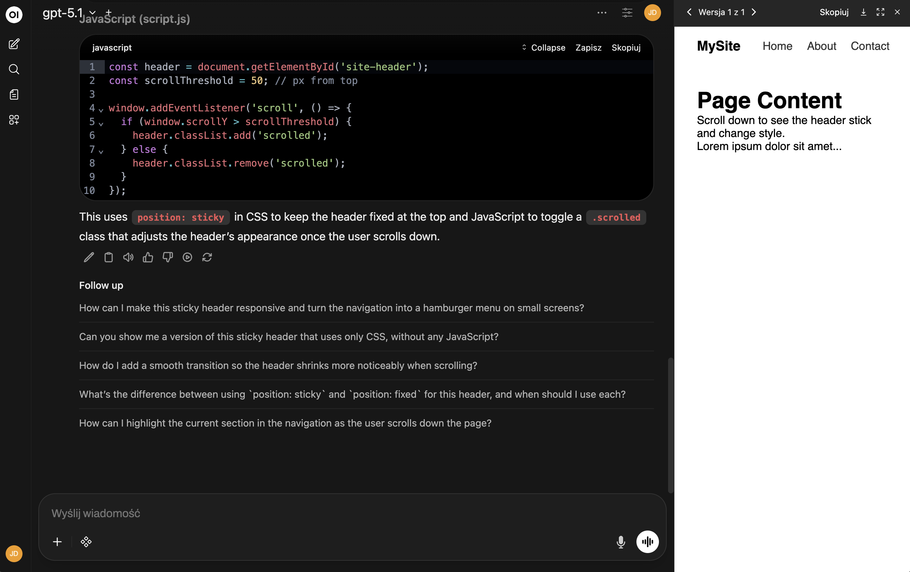

# Open WebUI

Open WebUI is a user-friendly web interface for interacting with Large Language Models. It provides a ChatGPT-like interface that can connect to various LLM providers including OpenAI, Ollama, and more.

```tf
module "open-webui" {
  count    = data.coder_workspace.me.start_count
  source   = "registry.coder.com/coder-labs/open-webui/coder"
  version  = "1.0.0"
  agent_id = coder_agent.main.id
}
```



## Prerequisites

- **Python 3.11 or higher** must be installed in your image (with `venv` module)
- Port 7800 (default) or your custom port must be available

For Ubuntu/Debian, you can install Python 3.11 from [deadsnakes PPA](https://launchpad.net/~deadsnakes/+archive/ubuntu/ppa):

```shell
sudo add-apt-repository -y ppa:deadsnakes/ppa
sudo apt-get update
sudo apt-get install -y python3.11 python3.11-venv
```

## Examples

### With OpenAI API Key

```tf
module "open-webui" {
  count    = data.coder_workspace.me.start_count
  source   = "registry.coder.com/coder-labs/open-webui/coder"
  version  = "1.0.0"
  agent_id = coder_agent.main.id

  openai_api_key = var.openai_api_key
}
```

### Custom Port and Data Directory

```tf
module "open-webui" {
  count    = data.coder_workspace.me.start_count
  source   = "registry.coder.com/coder-labs/open-webui/coder"
  version  = "1.0.0"
  agent_id = coder_agent.main.id

  http_server_port = 8080
  data_dir         = "/home/coder/open-webui-data"
}
```
