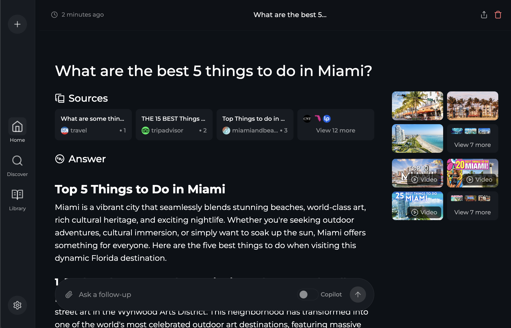

# Perplexica

Run [Perplexica](https://github.com/ItzCrazyKns/Perplexica), a privacy-focused AI search engine, in your Coder workspace.

TODO add sentence about support for local LLMs and cloud providers like OpenAI or Claude.

```tf
module "perplexica" {
  count    = data.coder_workspace.me.start_count
  source   = "registry.coder.com/coder-labs/perplexica/coder"
  version  = "1.0.0"
  agent_id = coder_agent.main.id
}
```

TODO mention embedded SearXNG due to simplicity and easier startup with less dependencies.



## Prerequisites

TODO docker

## Examples

### With API Keys

```tf
module "perplexica" {
  count             = data.coder_workspace.me.start_count
  source            = "registry.coder.com/coder-labs/perplexica/coder"
  version           = "1.0.0"
  agent_id          = coder_agent.main.id
  openai_api_key    = var.openai_api_key
  anthropic_api_key = var.anthropic_api_key
}
```

### With Local Ollama

```tf
module "perplexica" {
  count          = data.coder_workspace.me.start_count
  source         = "registry.coder.com/coder-labs/perplexica/coder"
  version        = "1.0.0"
  agent_id       = coder_agent.main.id
  ollama_api_url = "http://ollama-external-endpoint:11434"
}
```
