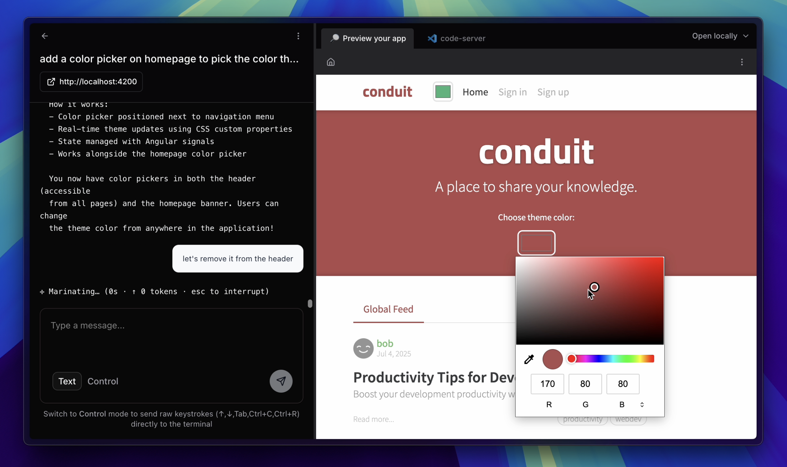

# Run Coder Tasks on Docker

This is an example template for running [Coder Tasks](https://coder.com/docs/ai-coder/tasks), Claude Code, along with a [real world application](https://realworld-docs.netlify.app/).



This is a fantastic starting point for working with AI agents with Coder Tasks. Try prompts such as:

- "Make the background color blue"
- "Add a dark mode"
- "Rewrite the entire backend in Go"

## Included in this template

This template is designed to be an example and a reference for building other templates with Coder Tasks. You can always run Coder Tasks on different infrastructure (e.g. as on Kubernetes, VMs) and with your own GitHub repositories, MCP servers, images, etc.

Additionally, this template uses our [Claude Code](https://registry.coder.com/modules/coder/claude-code) module, but [other agents](https://registry.coder.com/modules?search=tag%3Aagent) or even [custom agents](https://coder.com/docs/ai-coder/custom-agents) can be used in its place.

This template uses a [Workspace Preset](https://coder.com/docs/admin/templates/extending-templates/parameters#workspace-presets) that pre-defines:

- Universal Container Image (e.g. contains Node.js, Java, Python, Ruby, etc)
- MCP servers (desktop-commander for long-running logs, playwright for previewing changes)
- System prompt and [repository](https://github.com/coder-contrib/realworld-django-rest-framework-angular) for the AI agent
- Startup script to initialize the repository and start the development server

## Add this template to your Coder deployment

You can also add this template to your Coder deployment and begin tinkering right away!

### Prerequisites

- Coder installed (see [our docs](https://coder.com/docs/install)), ideally a Linux VM with Docker
- Anthropic API Key (or access to Anthropic models via Bedrock or Vertex, see [Claude Code docs](https://docs.anthropic.com/en/docs/claude-code/third-party-integrations))
- Access to a Docker socket

  - If on the local VM, ensure the `coder` user is added to the Docker group (docs)

    ```sh
    # Add coder user to Docker group
    sudo adduser coder docker
    
    # Restart Coder server
    sudo systemctl restart coder
    
    # Test Docker
    sudo -u coder docker ps
    ```

  - If on a remote VM, see the [Docker Terraform provider documentation](https://registry.terraform.io/providers/kreuzwerker/docker/latest/docs#remote-hosts) to configure a remote host

To import this template into Coder, first create a template from "Scratch" in the template editor.

Visit this URL for your Coder deployment:

```sh
https://coder.example.com/templates/new?exampleId=scratch
```

After creating the template, paste the contents from [main.tf](./main.tf) into the template editor and save.

Alternatively, you can use the Coder CLI to [push the template](https://coder.com/docs/reference/cli/templates_push)

```sh
# Download the CLI
curl -L https://coder.com/install.sh | sh

# Log in to your deployment
coder login https://coder.example.com

# Clone the registry
git clone https://github.com/coder/registry
cd registry

# Navigate to this template
cd registry/coder-labs/templates/tasks-docker

# Push the template
coder templates push
```
