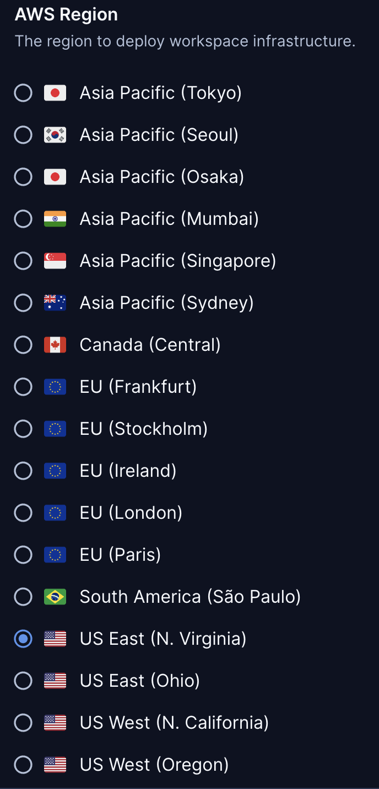
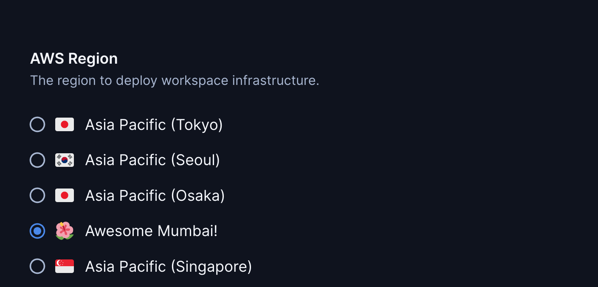
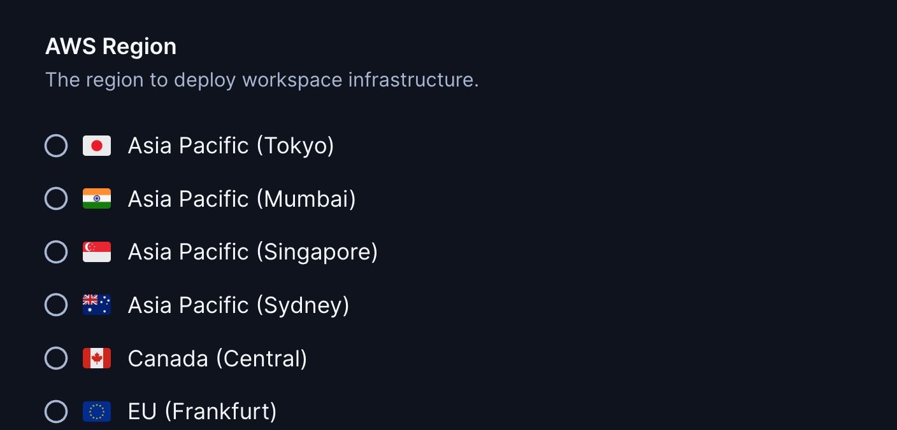

# AWS Region

A parameter with all AWS regions. This allows developers to select
the region closest to them.

Customize the preselected parameter value:

```tf
module "aws_region" {
  count   = data.coder_workspace.me.start_count
  source  = "registry.coder.com/coder/aws-region/coder"
  version = "1.1.0"
  default = "us-east-1"
}

provider "aws" {
  region = module.aws_region[0].value
}
```



## Examples

### Provision in the selected region's availability zone

The `default_availability_zone` output resolves the selected region to a
concrete zone (for example `us-east-1a`), so templates no longer have to guess
it by appending a letter to the region ID:

```tf
module "aws_region" {
  source  = "registry.coder.com/coder/aws-region/coder"
  version = "1.1.0"
  default = "us-east-1"
}

provider "aws" {
  region = module.aws_region.value
}

resource "aws_instance" "dev" {
  ami               = data.aws_ami.ubuntu.id
  instance_type     = "t3.micro"
  availability_zone = module.aws_region.default_availability_zone
  # ...
}
```

### Use the outputs without a parameter

Set `create_parameter = false` to skip the region picker and pin a region
yourself, while still using the module's outputs (for example
`default_availability_zone` or the full `regions` catalog):

```tf
module "aws_region" {
  source           = "registry.coder.com/coder/aws-region/coder"
  version          = "1.1.0"
  create_parameter = false
  default          = "us-east-1"
}

provider "aws" {
  region = module.aws_region.value # "us-east-1"
}

# module.aws_region.default_availability_zone => "us-east-1a"
# module.aws_region.regions                   => full catalog keyed by region ID
```

### Customize regions

Change the display name and icon for a region using the corresponding maps:

```tf
module "aws_region" {
  count   = data.coder_workspace.me.start_count
  source  = "registry.coder.com/coder/aws-region/coder"
  version = "1.1.0"
  default = "ap-south-1"

  custom_names = {
    "ap-south-1" : "Awesome Mumbai!"
  }

  custom_icons = {
    "ap-south-1" : "/emojis/1f33a.png"
  }
}

provider "aws" {
  region = module.aws_region[0].value
}
```



### Exclude regions

Hide the Asia Pacific regions Seoul and Osaka:

```tf
module "aws_region" {
  count   = data.coder_workspace.me.start_count
  source  = "registry.coder.com/coder/aws-region/coder"
  version = "1.1.0"
  exclude = ["ap-northeast-2", "ap-northeast-3"]
}

provider "aws" {
  region = module.aws_region[0].value
}
```



## Outputs

| Output                      | Description                                                                                     |
| --------------------------- | ----------------------------------------------------------------------------------------------- |
| `value`                     | The ID of the selected region, e.g. `us-east-1`.                                                |
| `default_availability_zone` | The default availability zone for the selected region, e.g. `us-east-1a`.                       |
| `regions`                   | Every region keyed by ID, each with `name`, `country`, `icon`, and `default_availability_zone`. |

## Updating regions.json

`regions.json` is a static catalog of region IDs and display names, so the
module needs no AWS provider or credentials at plan time. Flag icons are not
stored in the JSON: each entry carries a `country` code that maps to a flag in
the `flags` map in `main.tf`.

To refresh the list from AWS, use the AWS CLI. Region codes come from
`ec2:DescribeRegions`, and the human-readable names come from the public
`global-infrastructure` SSM parameters (hosted in `us-east-1`):

```bash
for region in $(aws ec2 describe-regions --all-regions \
  --query 'Regions[].RegionName' --output text); do
  name=$(aws ssm get-parameter --region us-east-1 \
    --name "/aws/service/global-infrastructure/regions/$region/longName" \
    --query 'Parameter.Value' --output text)
  printf '%s\t%s\n' "$region" "$name"
done
```

For each region, add or update an entry in `regions.json` with:

- `value`: the region code, e.g. `us-east-1`.
- `name`: the display name. Use the `longName` verbatim so names stay consistent; AWS returns `Europe (...)` for every European region, `US East (...)`, and so on.
- `country`: the key of the flag to show, from the `flags` map in `main.tf`. Add
  a new `country = "/emojis/....png"` entry there if the region needs a flag that
  is not already listed.

## Related templates

For a complete AWS EC2 template, see the following examples in the [Coder Registry](https://registry.coder.com/).

- [AWS EC2 (Linux)](https://registry.coder.com/templates/aws-linux)
- [AWS EC2 (Windows)](https://registry.coder.com/templates/aws-windows)
