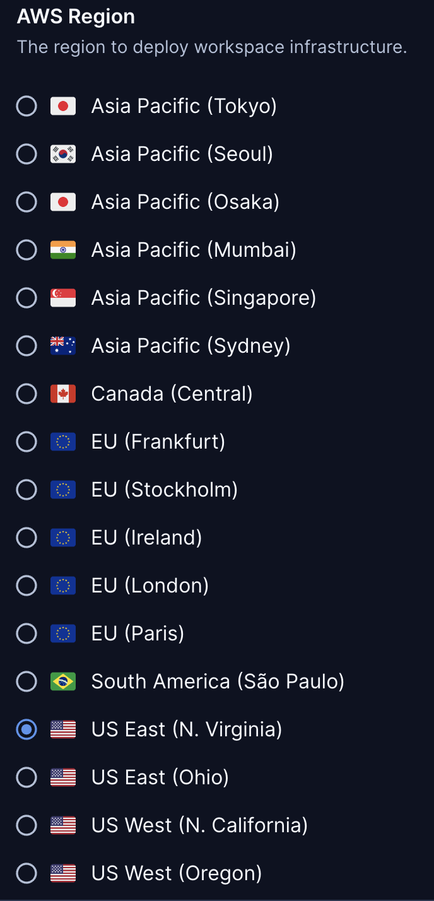
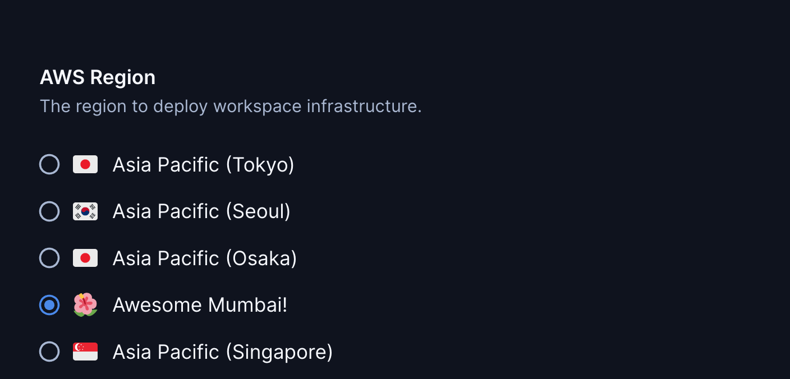
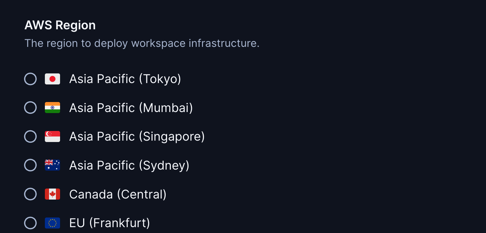

# AWS Region

A parameter with all AWS regions. This allows developers to select
the region closest to them.

Customize the preselected parameter value:

```tf
module "aws-region" {
  count   = data.coder_workspace.me.start_count
  source  = "registry.coder.com/coder/aws-region/coder"
  version = "1.1.0"
  default = "us-east-1"
}

provider "aws" {
  region = module.aws-region[0].value
}
```



## Examples

### Provision in the selected region's availability zone

The `default_availability_zone` output resolves the selected region to a
concrete zone (for example `us-east-1a`), so templates no longer have to guess
it by appending a letter to the region ID:

```tf
module "aws-region" {
  source  = "registry.coder.com/coder/aws-region/coder"
  version = "1.1.0"
  default = "us-east-1"
}

provider "aws" {
  region = module.aws-region.value
}

resource "aws_instance" "dev" {
  ami               = data.aws_ami.ubuntu.id
  instance_type     = "t3.micro"
  availability_zone = module.aws-region.default_availability_zone
  # ...
}
```

### Use the outputs without a parameter

Set `create_parameter = false` to skip the region picker and pin a region
yourself, while still using the module's outputs (for example
`default_availability_zone` or the full `regions` catalog):

```tf
module "aws-region" {
  source           = "registry.coder.com/coder/aws-region/coder"
  version          = "1.1.0"
  create_parameter = false
  default          = "us-east-1"
}

provider "aws" {
  region = module.aws-region.value # "us-east-1"
}

# module.aws-region.default_availability_zone => "us-east-1a"
# module.aws-region.regions                   => full catalog keyed by region ID
```

### Customize regions

Change the display name and icon for a region using the corresponding maps:

```tf
module "aws-region" {
  count   = data.coder_workspace.me.start_count
  source  = "registry.coder.com/coder/aws-region/coder"
  version = "1.1.0"
  default = "ap-south-1"

  custom_names = {
    "ap-south-1" : "Awesome Mumbai!"
  }

  custom_icons = {
    "ap-south-1" : "/emojis/1f33a.png"
  }
}

provider "aws" {
  region = module.aws-region[0].value
}
```



### Exclude regions

Hide the Asia Pacific regions Seoul and Osaka:

```tf
module "aws-region" {
  count   = data.coder_workspace.me.start_count
  source  = "registry.coder.com/coder/aws-region/coder"
  version = "1.1.0"
  exclude = ["ap-northeast-2", "ap-northeast-3"]
}

provider "aws" {
  region = module.aws-region[0].value
}
```



## AWS credentials

This module only selects a region; it does not handle AWS authentication. Give
the `aws` provider credentials from the environment instead of hardcoding keys
in the template, for example an IAM instance profile or role on the Coder
provisioner, or credentials injected into the provisioner's environment. See the
[AWS provider authentication docs](https://registry.terraform.io/providers/hashicorp/aws/latest/docs#authentication-and-configuration).

## Outputs

| Output                      | Description                                                                          |
| --------------------------- | ------------------------------------------------------------------------------------ |
| `value`                     | The ID of the selected region, e.g. `us-east-1`.                                     |
| `default_availability_zone` | The default availability zone for the selected region, e.g. `us-east-1a`.            |
| `regions`                   | Every region keyed by ID, each with `name`, `icon`, and `default_availability_zone`. |

## Updating regions.json

`regions.json` is a generated catalog of region IDs, display names, and flag
icons, so the module needs no AWS provider or credentials at plan time.
Terraform only reads the file; all the flag logic lives in the update script.

Regenerate it from AWS with the AWS CLI (any credentials) and `jq`. Names and
country codes come from the public `global-infrastructure` SSM parameters in
`us-east-1`; European regions share the EU flag:

```bash
bash .scripts/update.sh
```

## Related templates

For a complete AWS EC2 template, see the following examples in the [Coder Registry](https://registry.coder.com/).

- [AWS EC2 (Linux)](https://registry.coder.com/templates/aws-linux)
- [AWS EC2 (Windows)](https://registry.coder.com/templates/aws-windows)
