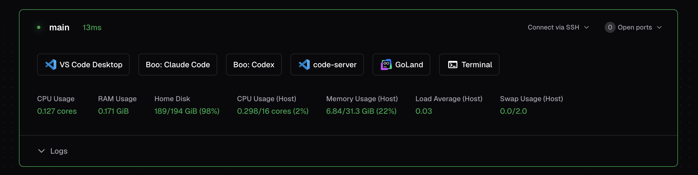

# Boo



Install [boo](https://github.com/coder/boo) and run commands in persistent, named terminal sessions. Boo is a GNU screen-style terminal multiplexer built on [libghostty](https://github.com/ghostty-org/ghostty) (Zig).

```tf
module "boo" {
  source   = "registry.coder.com/coder/boo/coder"
  version  = "1.0.0"
  agent_id = coder_agent.main.id
}
```

## Usage

Pass a list of session definitions and the module creates one `coder_app` per session. Each session requires `session_name` and `command`; `display_name` and `slug` are optional. Clicking an app creates the session and attaches to it; clicking again reattaches to the running session.

### Multiple sessions

Create separate persistent sessions for a dev server and an interactive shell, each with its own coder_app.

```tf
module "boo" {
  source   = "registry.coder.com/coder/boo/coder"
  version  = "1.0.0"
  agent_id = coder_agent.main.id
  sessions = [
    {
      session_name = "server"
      display_name = "Server"
      slug         = "server"
      command      = "npm run dev"
    },
    {
      session_name = "shell"
      display_name = "Shell"
      slug         = "shell"
      command      = "bash"
    },
  ]
}
```

This creates:

- `coder_app` slugs `server` and `shell`
- Display names `Server` and `Shell`

### Multi-line commands

Session commands can be full shell scripts. The script is written to `~/.coder-modules/coder/boo/<session_name>/scripts/start.sh` and executed inside the boo session.

```tf
module "boo" {
  source   = "registry.coder.com/coder/boo/coder"
  version  = "1.0.0"
  agent_id = coder_agent.main.id
  sessions = [
    {
      session_name = "watcher"
      display_name = "Watcher"
      slug         = "watcher"
      command      = <<-EOT
        #!/bin/bash
        while true; do
          echo "$(date): watching..."
          sleep 10
        done
      EOT
    },
  ]
}
```

### Use pre/post install hooks

```tf
module "boo" {
  source              = "registry.coder.com/coder/boo/coder"
  version             = "1.0.0"
  agent_id            = coder_agent.main.id
  pre_install_script  = "echo 'Preparing environment...'"
  post_install_script = "echo 'boo ready'"
  sessions = [
    {
      session_name = "shell"
      display_name = "Shell"
      slug         = "shell"
      command      = "bash"
    },
  ]
}
```

### Serialize another module behind the boo install

Use `output.scripts` to wait for the boo install pipeline to complete before running downstream work.

```tf
module "boo" {
  source   = "registry.coder.com/coder/boo/coder"
  version  = "1.0.0"
  agent_id = coder_agent.main.id
  sessions = [
    {
      session_name = "shell"
      display_name = "Shell"
      slug         = "shell"
      command      = "bash"
    },
  ]
}

resource "coder_script" "after_boo" {
  agent_id     = coder_agent.main.id
  display_name = "After Boo"
  run_on_start = true
  script       = <<-EOT
    #!/bin/bash
    coder exp sync want after-boo ${join(" ", module.boo.scripts)}
    coder exp sync start after-boo
    trap 'coder exp sync complete after-boo' EXIT
    echo "boo install complete"
  EOT
}
```

## Troubleshooting

The install log is written under `~/.coder-modules/coder/boo/logs/`. Session scripts are written to `~/.coder-modules/coder/boo/<session_name>/scripts/start.sh`.

```
~/.coder-modules/coder/boo/
├── logs/
│   └── install.log
└── <session_name>/
    └── scripts/
        └── start.sh
```

Check `install.log` for installation errors. If an app does not connect, verify the session exists by running `boo ls` in a terminal.
