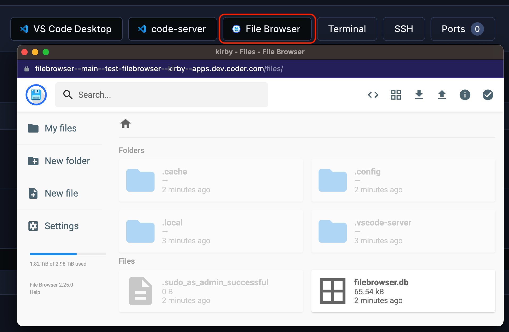

# File Browser

A file browser for your workspace.

```tf
module "filebrowser" {
  count    = data.coder_workspace.me.start_count
  source   = "registry.coder.com/coder/filebrowser/coder"
  version  = "1.1.5"
  agent_id = coder_agent.main.id
}
```



## Examples

### Serve a specific directory

```tf
module "filebrowser" {
  count    = data.coder_workspace.me.start_count
  source   = "registry.coder.com/coder/filebrowser/coder"
  version  = "1.1.5"
  agent_id = coder_agent.main.id
  folder   = "/home/coder/project"
}
```

### Specify location of `filebrowser.db`

```tf
module "filebrowser" {
  count         = data.coder_workspace.me.start_count
  source        = "registry.coder.com/coder/filebrowser/coder"
  version       = "1.1.5"
  agent_id      = coder_agent.main.id
  database_path = ".config/filebrowser.db"
}
```

### Serve from the same domain (no subdomain)

When `subdomain = false`, you must also set `agent_name` to the name of your `coder_agent` resource. Coder serves path-based apps at `/@<owner>/<workspace>.<agent>/apps/<slug>/`, so the agent name is required to build a base URL that matches the URL the user is actually browsing. If `agent_name` is omitted in this mode, `terraform apply` will fail with an explanatory error.

```tf
module "filebrowser" {
  count      = data.coder_workspace.me.start_count
  source     = "registry.coder.com/coder/filebrowser/coder"
  version    = "1.1.5"
  agent_id   = coder_agent.main.id
  agent_name = "main"
  subdomain  = false
}
```
