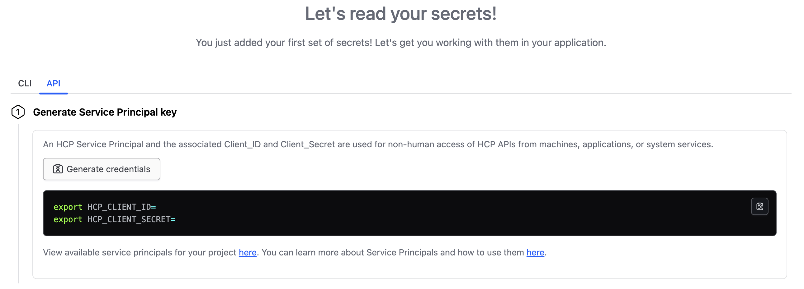

# HCP Vault Secrets

> [!WARNING]
> **⚠️ DEPRECATED: HCP Vault Secrets is being sunset**
>
> HashiCorp has announced that HCP Vault Secrets will no longer be available for purchase by new customers after **June 30th, 2025**. This module will stop working when HCP Vault Secrets is fully discontinued.
>
> **Use these Coder registry modules instead:**
>
> - **[vault-token](https://registry.coder.com/modules/vault-token)** - Connect to Vault using access tokens
> - **[vault-jwt](https://registry.coder.com/modules/vault-jwt)** - Connect to Vault using JWT/OIDC authentication
> - **[vault-github](https://registry.coder.com/modules/vault-github)** - Connect to Vault using GitHub authentication
>
> These modules work with both self-hosted Vault and HCP Vault Dedicated. For migration help, see the [official HashiCorp announcement](https://developer.hashicorp.com/hcp/docs/vault-secrets/end-of-sale-announcement).

This module lets you fetch all or selective secrets from a [HCP Vault Secrets](https://developer.hashicorp.com/hcp/docs/vault-secrets) app into your [Coder](https://coder.com) workspaces. It makes use of the [`hcp_vault_secrets_app`](https://registry.terraform.io/providers/hashicorp/hcp/latest/docs/data-sources/vault_secrets_app) data source from the [HCP provider](https://registry.terraform.io/providers/hashicorp/hcp/latest).

```tf
module "vault" {
  source     = "registry.coder.com/coder/hcp-vault-secrets/coder"
  version    = "1.0.32"
  agent_id   = coder_agent.example.id
  app_name   = "demo-app"
  project_id = "aaa-bbb-ccc"
}
```

## Configuration

To configure the HCP Vault Secrets module, follow these steps,

1. [Create secrets in HCP Vault Secrets](https://developer.hashicorp.com/vault/tutorials/hcp-vault-secrets-get-started/hcp-vault-secrets-create-secret)
2. Create an HCP Service Principal from the HCP Vault Secrets app in the HCP console. This will give you the `HCP_CLIENT_ID` and `HCP_CLIENT_SECRET` that you need to authenticate with HCP Vault Secrets.
   
3. Set `HCP_CLIENT_ID` and `HCP_CLIENT_SECRET` variables on the coder provisioner (recommended) or supply them as input to the module.
4. Set the `project_id`. This is the ID of the project where the HCP Vault Secrets app is running.

> See the [HCP Vault Secrets documentation](https://developer.hashicorp.com/hcp/docs/vault-secrets) for more information.

## Fetch All Secrets

To fetch all secrets from the HCP Vault Secrets app, skip the `secrets` input.

```tf
module "vault" {
  source     = "registry.coder.com/coder/hcp-vault-secrets/coder"
  version    = "1.0.32"
  agent_id   = coder_agent.example.id
  app_name   = "demo-app"
  project_id = "aaa-bbb-ccc"
}
```

## Fetch Selective Secrets

To fetch selective secrets from the HCP Vault Secrets app, set the `secrets` input.

```tf
module "vault" {
  source     = "registry.coder.com/coder/hcp-vault-secrets/coder"
  version    = "1.0.32"
  agent_id   = coder_agent.example.id
  app_name   = "demo-app"
  project_id = "aaa-bbb-ccc"
  secrets    = ["MY_SECRET_1", "MY_SECRET_2"]
}
```

## Set Client ID and Client Secret as Inputs

Set `client_id` and `client_secret` as module inputs.

```tf
module "vault" {
  source        = "registry.coder.com/coder/hcp-vault-secrets/coder"
  version       = "1.0.32"
  agent_id      = coder_agent.example.id
  app_name      = "demo-app"
  project_id    = "aaa-bbb-ccc"
  client_id     = "HCP_CLIENT_ID"
  client_secret = "HCP_CLIENT_SECRET"
}
```
