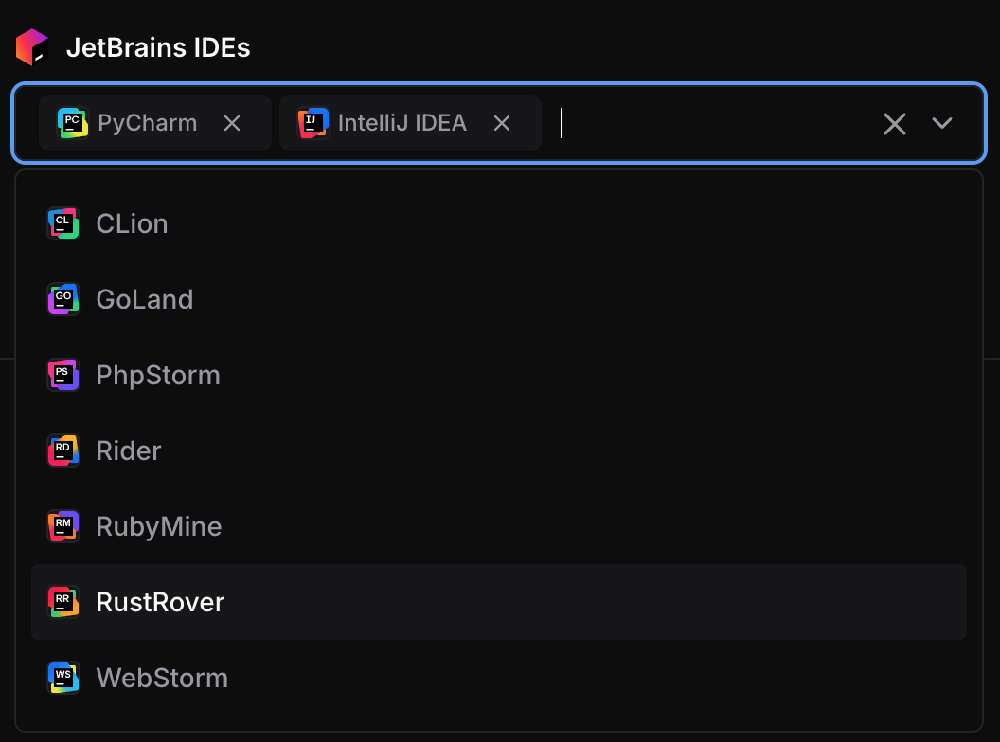

# JetBrains IDEs

This module adds JetBrains IDE buttons to launch IDEs directly from the dashboard by integrating with the JetBrains Toolbox.

```tf
module "jetbrains" {
  count    = data.coder_workspace.me.start_count
  source   = "registry.coder.com/coder/jetbrains/coder"
  version  = "1.4.0"
  agent_id = coder_agent.main.id
  folder   = "/home/coder/project"
}
```



> [!IMPORTANT]
> This module requires Coder version 2.24+ and [JetBrains Toolbox](https://www.jetbrains.com/toolbox-app/) version 2.7 or higher.

> [!WARNING]
> JetBrains recommends a minimum of 4 CPU cores and 8GB of RAM.
> Consult the [JetBrains documentation](https://www.jetbrains.com/help/idea/prerequisites.html#min_requirements) to confirm other system requirements.

## Examples

### Pre-configured Mode (Direct App Creation)

When `default` contains IDE codes, those IDEs are created directly without user selection:

```tf
module "jetbrains" {
  count    = data.coder_workspace.me.start_count
  source   = "registry.coder.com/coder/jetbrains/coder"
  version  = "1.4.0"
  agent_id = coder_agent.main.id
  folder   = "/home/coder/project"
  default  = ["PY", "IU"] # Pre-configure PyCharm and IntelliJ IDEA
}
```

### User Choice with Limited Options

```tf
module "jetbrains" {
  count    = data.coder_workspace.me.start_count
  source   = "registry.coder.com/coder/jetbrains/coder"
  version  = "1.4.0"
  agent_id = coder_agent.main.id
  folder   = "/home/coder/project"
  # Show parameter with limited options
  options = ["IU", "PY"] # Only these IDEs are available for selection
}
```

### Early Access Preview (EAP) Versions

```tf
module "jetbrains" {
  count         = data.coder_workspace.me.start_count
  source        = "registry.coder.com/coder/jetbrains/coder"
  version       = "1.4.0"
  agent_id      = coder_agent.main.id
  folder        = "/home/coder/project"
  default       = ["IU", "PY"]
  channel       = "eap"    # Use Early Access Preview versions
  major_version = "2025.2" # Specific major version
}
```

### Pinned Versions (Air-Gapped / Cached)

When `ide_config` is set, the module makes zero HTTP calls and uses the
provided build numbers directly. This is ideal for air-gapped environments
or when caching IDE installations.

> [!TIP]
> To find the latest build number for an IDE, query the JetBrains releases API:
>
> ```sh
> curl -s "https://data.services.jetbrains.com/products/releases?code=GO&type=release&latest=true" | jq 'to_entries[0].value[0] | {build, version}'
> ```
>
> Replace `GO` with the product code for the IDE you want (e.g. `IU`, `PY`, `CL`).

```tf
module "jetbrains" {
  count    = data.coder_workspace.me.start_count
  source   = "registry.coder.com/coder/jetbrains/coder"
  version  = "1.4.0"
  agent_id = coder_agent.main.id
  folder   = "/home/coder/project"

  # Only build is required. Name and icon fall back to built-in defaults.
  ide_config = {
    "GO" = { build = "261.22158.291" }
    "PY" = { build = "261.22158.340" }
    # Add entries for other IDEs as needed.
  }

  options = ["GO", "PY"] # Must match the keys in ide_config.
}
```

### Single IDE for Specific Use Case

```tf
module "jetbrains_pycharm" {
  count    = data.coder_workspace.me.start_count
  source   = "registry.coder.com/coder/jetbrains/coder"
  version  = "1.4.0"
  agent_id = coder_agent.main.id
  folder   = "/workspace/project"

  default = ["PY"] # Only PyCharm

  # Specific version for consistency
  major_version = "2025.1"
  channel       = "release"
}
```

### Custom Tooltip

Add helpful tooltip text that appears when users hover over the IDE app buttons:

```tf
module "jetbrains" {
  count    = data.coder_workspace.me.start_count
  source   = "registry.coder.com/coder/jetbrains/coder"
  version  = "1.4.0"
  agent_id = coder_agent.main.id
  folder   = "/home/coder/project"
  default  = ["IU", "PY"]
  tooltip  = "You need to install [JetBrains Toolbox App](https://www.jetbrains.com/toolbox-app/) to use this button."
}
```

### Plugin Auto‑Installer

This module now supports automatic JetBrains plugin installation inside your workspace.

To get a plugin ID, open the plugin’s page on the JetBrains Marketplace. Scroll down to Additional Information and look for Plugin ID. Use that value in the configuration below.

```tf
module "jetbrains" {
  count    = data.coder_workspace.me.start_count
  source   = "registry.coder.com/coder/jetbrains/coder"
  version  = "1.2.1"
  agent_id = coder_agent.main.id
  folder   = "/home/coder/project"
  default  = ["IU", "PY"]

  jetbrains_plugins = {
    "PY" = ["com.koxudaxi.pydantic", "com.intellij.kubernetes"]
    "IU" = ["<Plugin-ID>", "<Plugin-ID>"]
    "WS" = ["<Plugin-ID>", "<Plugin-ID>"]
    "GO" = ["<Plugin-ID>", "<Plugin-ID>"]
    "CL" = ["<Plugin-ID>", "<Plugin-ID>"]
    "PS" = ["<Plugin-ID>", "<Plugin-ID>"]
    "RD" = ["<Plugin-ID>", "<Plugin-ID>"]
    "RM" = ["<Plugin-ID>", "<Plugin-ID>"]
    "RR" = ["<Plugin-ID>", "<Plugin-ID>"]
  }
}
```

> [!IMPORTANT]
> After installing the IDE, restart the workspace.
> When the workspace starts again, the scripts will detect the installed IDE and automatically install the configured plugins.
>
> This module prerequisites and limitations
>
> 1. Requires JetBrains Toolbox to be installed
> 2. Requires jq to be available
> 3. only works in a Linux environment.

> [!WARNING]
> Some plugins are disabled by default due to JetBrains security defaults, so you might need to enable them manually.

### Accessing the IDE Metadata

You can now reference the output `ide_metadata` as a map.

```tf
# Add metadata to the container showing the installed IDEs and their build versions.
resource "coder_metadata" "container_info" {
  count       = data.coder_workspace.me.start_count
  resource_id = one(docker_container.workspace).id

  dynamic "item" {
    for_each = length(module.jetbrains) > 0 ? one(module.jetbrains).ide_metadata : {}
    content {
      key   = item.value.build
      value = "${item.value.name} [${item.key}]"
    }
  }
}
```

## Behavior

### Parameter vs Direct Apps

- **`default = []` (empty)**: Creates a `coder_parameter` allowing users to select IDEs from `options`
- **`default` with values**: Skips parameter and directly creates `coder_app` resources for the specified IDEs

### Version Resolution

- **`ide_config` not set (default)**: Build numbers are fetched from the JetBrains releases API. If the API is unreachable, Terraform will return an error rather than silently using stale versions.
- **`ide_config` set**: The module skips all HTTP calls and uses the provided build numbers directly. No network access required. Ideal for air-gapped deployments or when caching IDE installations.
- `major_version` and `channel` control which API endpoint is queried (only when `ide_config` is not set).

## Supported IDEs

All JetBrains IDEs with remote development capabilities:

- [CLion (`CL`)](https://www.jetbrains.com/clion/)
- [GoLand (`GO`)](https://www.jetbrains.com/go/)
- [IntelliJ IDEA Ultimate (`IU`)](https://www.jetbrains.com/idea/)
- [PhpStorm (`PS`)](https://www.jetbrains.com/phpstorm/)
- [PyCharm Professional (`PY`)](https://www.jetbrains.com/pycharm/)
- [Rider (`RD`)](https://www.jetbrains.com/rider/)
- [RubyMine (`RM`)](https://www.jetbrains.com/ruby/)
- [RustRover (`RR`)](https://www.jetbrains.com/rust/)
- [WebStorm (`WS`)](https://www.jetbrains.com/webstorm/)
