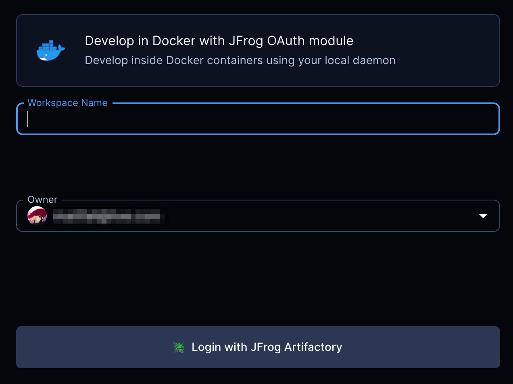

# JFrog

Install the JF CLI and authenticate package managers with Artifactory using OAuth configured via the Coder [`external-auth`](https://coder.com/docs/v2/latest/admin/external-auth) feature.



```tf
module "jfrog" {
  count          = data.coder_workspace.me.start_count
  source         = "registry.coder.com/coder/jfrog-oauth/coder"
  version        = "1.0.31"
  agent_id       = coder_agent.example.id
  jfrog_url      = "https://example.jfrog.io"
  username_field = "username" # If you are using GitHub to login to both Coder and Artifactory, use username_field = "username"

  package_managers = {
    npm    = ["npm", "@scoped:npm-scoped"]
    go     = ["go", "another-go-repo"]
    pypi   = ["pypi", "extra-index-pypi"]
    docker = ["example-docker-staging.jfrog.io", "example-docker-production.jfrog.io"]
    maven  = ["maven-local", "maven-remote", "maven-virtual"]
  }
}
```

> Note
> This module does not install `npm`, `go`, `pip`, etc but only configure them. You need to handle the installation of these tools yourself.

## Prerequisites

This module is usable by JFrog self-hosted (on-premises) Artifactory as it requires configuring a custom integration. This integration benefits from Coder's [external-auth](https://coder.com/docs/v2/latest/admin/external-auth) feature and allows each user to authenticate with Artifactory using an OAuth flow and issues user-scoped tokens to each user. For configuration instructions, see this [guide](https://coder.com/docs/v2/latest/guides/artifactory-integration#jfrog-oauth) on the Coder documentation.

## Examples

Configure the Python pip package manager to fetch packages from Artifactory while mapping the Coder email to the Artifactory username.

```tf
module "jfrog" {
  count          = data.coder_workspace.me.start_count
  source         = "registry.coder.com/coder/jfrog-oauth/coder"
  version        = "1.0.31"
  agent_id       = coder_agent.example.id
  jfrog_url      = "https://example.jfrog.io"
  username_field = "email"

  package_managers = {
    pypi = ["pypi"]
  }
}
```

You should now be able to install packages from Artifactory using both the `jf pip` and `pip` command.

```shell
jf pip install requests
```

```shell
pip install requests
```

### Configure Maven

Configure the Maven package manager to fetch dependencies from Artifactory.

```tf
module "jfrog" {
  count          = data.coder_workspace.me.start_count
  source         = "registry.coder.com/coder/jfrog-oauth/coder"
  version        = "1.0.31"
  agent_id       = coder_agent.example.id
  jfrog_url      = "https://example.jfrog.io"
  username_field = "username"

  package_managers = {
    maven = ["maven-local", "maven-remote"]
  }
}
```

You should now be able to use Maven with Artifactory repositories:

```shell
jf mvn clean install
```

```shell
mvn clean install
```

### Configure code-server with JFrog extension

The [JFrog extension](https://open-vsx.org/extension/JFrog/jfrog-vscode-extension) for VS Code allows you to interact with Artifactory from within the IDE.

```tf
module "jfrog" {
  count                 = data.coder_workspace.me.start_count
  source                = "registry.coder.com/coder/jfrog-oauth/coder"
  version               = "1.0.31"
  agent_id              = coder_agent.example.id
  jfrog_url             = "https://example.jfrog.io"
  username_field        = "username" # If you are using GitHub to login to both Coder and Artifactory, use username_field = "username"
  configure_code_server = true       # Add JFrog extension configuration for code-server
  package_managers = {
    npm   = ["npm"]
    go    = ["go"]
    pypi  = ["pypi"]
    maven = ["maven-local"]
  }
}
```

### Using the access token in other terraform resources

JFrog Access token is also available as a terraform output. You can use it in other terraform resources. For example, you can use it to configure an [Artifactory docker registry](https://jfrog.com/help/r/jfrog-artifactory-documentation/docker-registry) with the [docker terraform provider](https://registry.terraform.io/providers/kreuzwerker/docker/latest/docs).

```tf
provider "docker" {
  # ...
  registry_auth {
    address  = "https://example.jfrog.io/artifactory/api/docker/REPO-KEY"
    username = try(module.jfrog[0].username, "")
    password = try(module.jfrog[0].access_token, "")
  }
}
```

> Here `REPO_KEY` is the name of docker repository in Artifactory.
