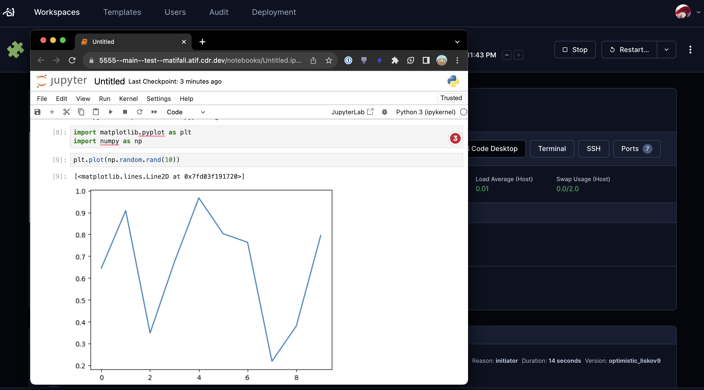

# Jupyter Notebook

A module that adds Jupyter Notebook in your Coder template.



Jupyter Notebook listens on `127.0.0.1` by default so that unauthenticated
traffic must pass through Coder's application proxy.

## Usage

```tf
module "jupyter-notebook" {
  count    = data.coder_workspace.me.start_count
  source   = "registry.coder.com/coder/jupyter-notebook/coder"
  version  = "1.3.0"
  agent_id = coder_agent.main.id
}
```

## External network access

> [!WARNING]
> For advanced environments that require direct network access, set `host`
> explicitly. Binding to `0.0.0.0` exposes the unauthenticated service to every
> reachable network interface and is less secure.

```tf
module "jupyter-notebook" {
  count    = data.coder_workspace.me.start_count
  source   = "registry.coder.com/coder/jupyter-notebook/coder"
  version  = "1.3.0"
  agent_id = coder_agent.main.id
  host     = "0.0.0.0"
}
```
