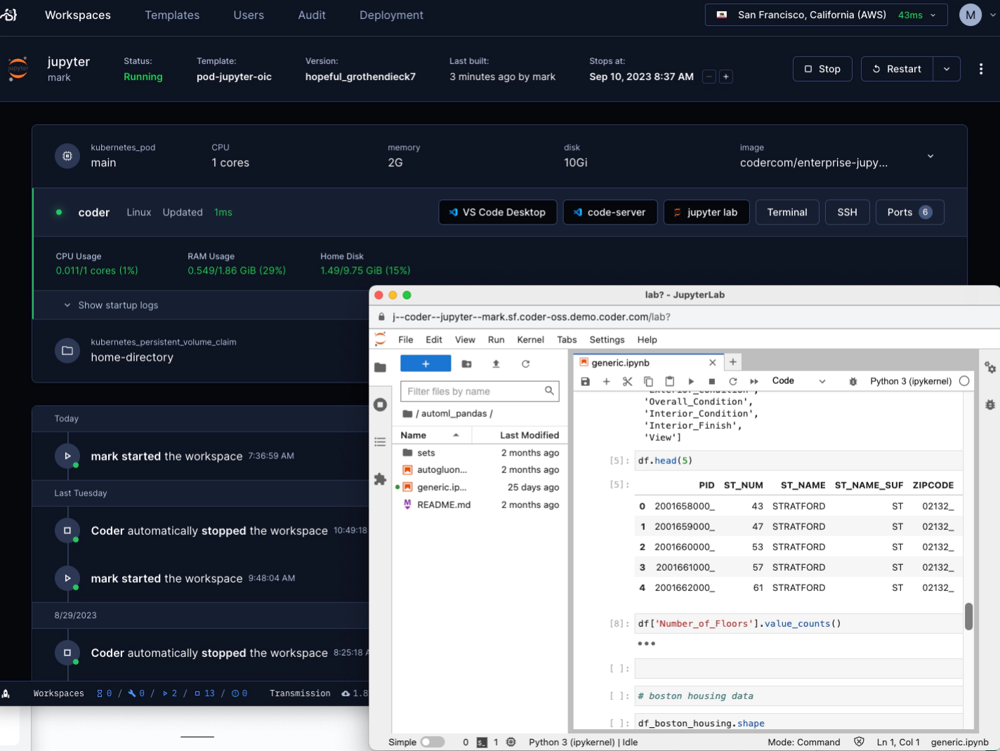

# JupyterLab

A module that adds JupyterLab in your Coder template.



```tf
module "jupyterlab" {
  count    = data.coder_workspace.me.start_count
  source   = "registry.coder.com/coder/jupyterlab/coder"
  version  = "1.1.1"
  agent_id = coder_agent.example.id
}
```

## Configuration

You can customize JupyterLab server settings by providing a JSON configuration:

```tf
module "jupyterlab" {
  count    = data.coder_workspace.me.start_count
  source   = "registry.coder.com/coder/jupyterlab/coder"
  version  = "1.1.1"
  agent_id = coder_agent.example.id
  config = {
    ServerApp = {
      port = 8888
      token = ""
      password = ""
      allow_origin = "*"
      base_url = "/lab"
    }
  }
}
```

The `config` parameter accepts a map of configuration settings that will be written to `~/.jupyter/jupyter_server_config.json` before JupyterLab starts. This allows you to configure any JupyterLab server settings according to the [JupyterLab configuration documentation](https://jupyter-server.readthedocs.io/en/latest/users/configuration.html).

### Common Configuration Examples

**Disable authentication:**
```tf
config = {
  ServerApp = {
    token = ""
    password = ""
  }
}
```

**Set custom port and allow all origins:**
```tf
config = {
  ServerApp = {
    port = 9999
    allow_origin = "*"
  }
}
```

**Configure notebook directory:**
```tf
config = {
  ServerApp = {
    root_dir = "/workspace/notebooks"
  }
}
```

**Set Content-Security-Policy for iframe embedding in Coder:**
```tf
module "jupyterlab" {
  count    = data.coder_workspace.me.start_count
  source   = "registry.coder.com/coder/jupyterlab/coder"
  version  = "1.1.1"
  agent_id = coder_agent.example.id
  config = {
    ServerApp = {
      tornado_settings = {
        headers = {
          "Content-Security-Policy" = "frame-ancestors 'self' ${data.coder_workspace.me.access_url}"
        }
      }
    }
  }
}
```
