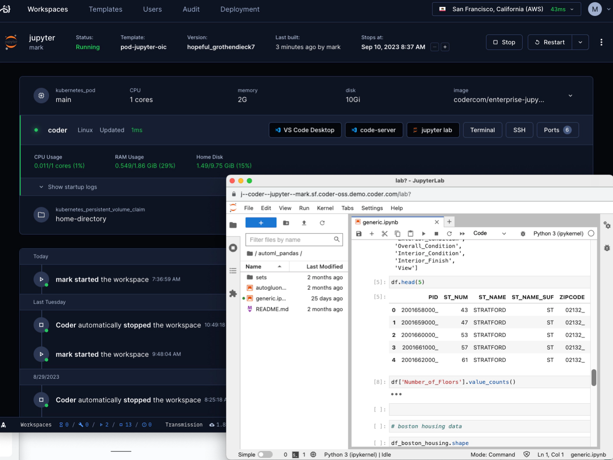

# JupyterLab

A module that adds JupyterLab in your Coder template.



JupyterLab listens on `127.0.0.1` by default so that unauthenticated traffic
must pass through Coder's application proxy.

## Usage

```tf
module "jupyterlab" {
  count    = data.coder_workspace.me.start_count
  source   = "registry.coder.com/coder/jupyterlab/coder"
  version  = "1.3.0"
  agent_id = coder_agent.main.id
}
```

## External network access

> [!WARNING]
> For advanced environments that require direct network access, set `host`
> explicitly. Binding to `0.0.0.0` exposes the unauthenticated service to every
> reachable network interface and is less secure.

```tf
module "jupyterlab" {
  count    = data.coder_workspace.me.start_count
  source   = "registry.coder.com/coder/jupyterlab/coder"
  version  = "1.3.0"
  agent_id = coder_agent.main.id
  host     = "0.0.0.0"
}
```

## Configuration

JupyterLab is automatically configured to work with Coder's iframe embedding. For advanced configuration, you can use the `config` parameter to provide additional JupyterLab server settings according to the [JupyterLab configuration documentation](https://jupyter-server.readthedocs.io/en/latest/users/configuration.html).

```tf
module "jupyterlab" {
  count    = data.coder_workspace.me.start_count
  source   = "registry.coder.com/coder/jupyterlab/coder"
  version  = "1.3.0"
  agent_id = coder_agent.main.id
  config = {
    ServerApp = {
      # Required for Coder Tasks iFrame embedding - do not remove
      tornado_settings = {
        headers = {
          "Content-Security-Policy" = "frame-ancestors 'self' ${data.coder_workspace.me.access_url}"
        }

      }
      # Your additional configuration here
      root_dir = "/workspace/notebooks"
    }
  }
}
```
