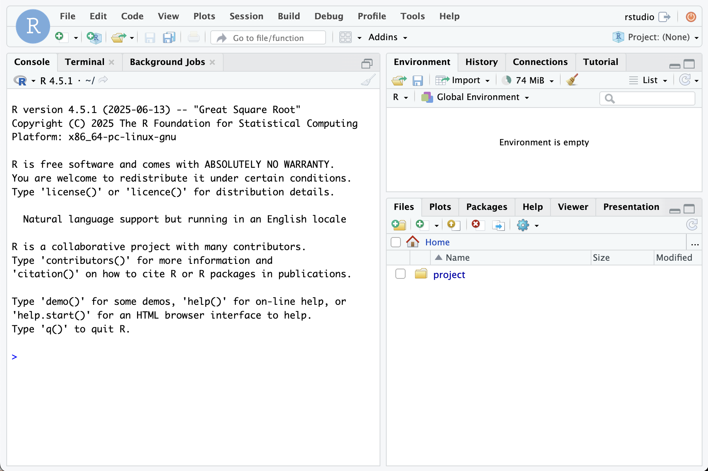

# RStudio Server

Deploy the Rocker Project distribution of RStudio Server in your Coder workspace.



```tf
module "rstudio-server" {
  count    = data.coder_workspace.me.start_count
  source   = "registry.coder.com/coder/rstudio-server/coder"
  version  = "0.9.0"
  agent_id = coder_agent.example.id
}
```
