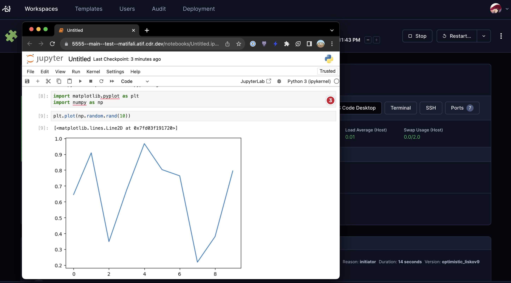

# Jupyter Notebook

A module that adds Jupyter Notebook in your Coder template.



```tf
module "jupyter-notebook" {
  count    = data.coder_workspace.me.start_count
  source   = "registry.coder.com/coder/jupyter-notebook/coder"
  version  = "1.2.0"
  agent_id = coder_agent.example.id
}
```
