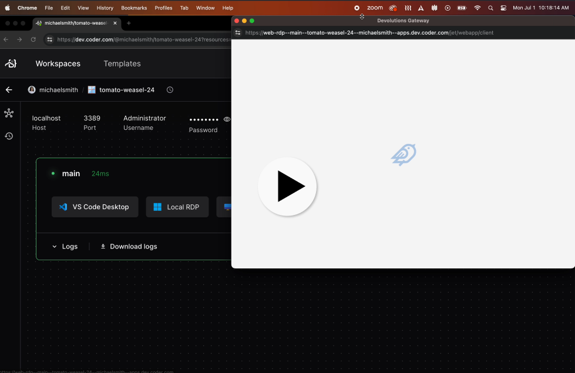

# Windows RDP

Enable Remote Desktop + a web based client on Windows workspaces, powered by [devolutions-gateway](https://github.com/Devolutions/devolutions-gateway).

```tf
# AWS example. See below for examples of using this module with other providers
module "windows_rdp" {
  count    = data.coder_workspace.me.start_count
  source   = "registry.coder.com/coder/windows-rdp/coder"
  version  = "1.4.0"
  agent_id = coder_agent.main.id
}
```

## Video

[](https://github.com/coder/modules/assets/28937484/fb5f4a55-7b69-4550-ab62-301e13a4be02)

## Examples

### With AWS

```tf
module "windows_rdp" {
  count    = data.coder_workspace.me.start_count
  source   = "registry.coder.com/coder/windows-rdp/coder"
  version  = "1.4.0"
  agent_id = coder_agent.main.id
}
```

### With Google Cloud

```tf
module "windows_rdp" {
  count    = data.coder_workspace.me.start_count
  source   = "registry.coder.com/coder/windows-rdp/coder"
  version  = "1.4.0"
  agent_id = coder_agent.main.id
}
```

### With Custom Devolutions Gateway Version

```tf
module "windows_rdp" {
  count                       = data.coder_workspace.me.start_count
  source                      = "registry.coder.com/coder/windows-rdp/coder"
  version                     = "1.4.0"
  agent_id                    = coder_agent.main.id
  devolutions_gateway_version = "2025.2.2" # Specify a specific version
}
```

### With RDP Keep-Alive

Automatically extend the workspace deadline while an RDP connection is active. This prevents workspace autostop during active remote desktop sessions:

```tf
module "windows_rdp" {
  count              = data.coder_workspace.me.start_count
  source             = "registry.coder.com/coder/windows-rdp/coder"
  version            = "1.4.0"
  agent_id           = coder_agent.main.id
  keepalive          = true
  keepalive_interval = 30 # Check every 30 seconds (default)
}
```

When `keepalive` is enabled, a background script monitors port 3389 for established RDP connections. On detection, it calls the [Coder workspace extend API](https://coder.com/docs/reference/api/workspaces#extend-workspace-deadline-by-id) to bump the workspace deadline. When the RDP session disconnects, the normal autostop countdown resumes.
