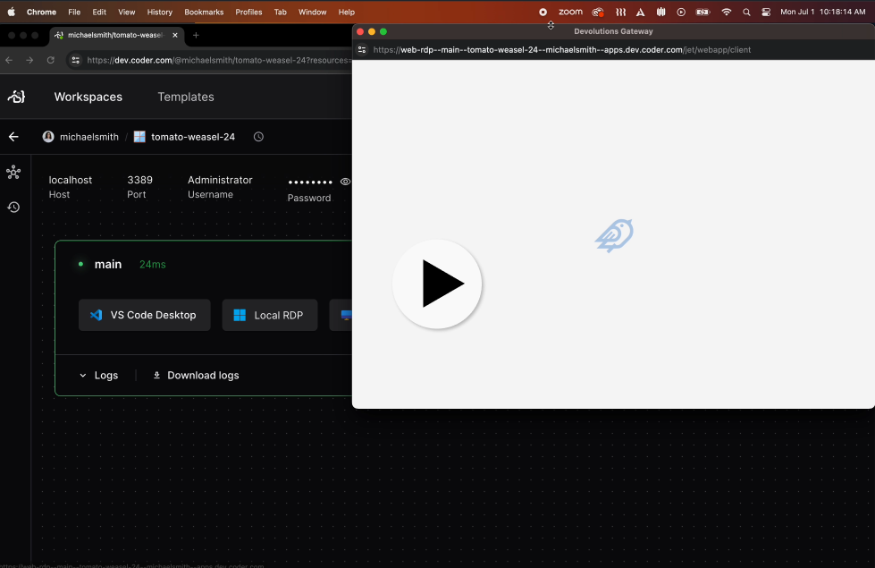

# Windows RDP

Enable Remote Desktop + a web based client on Windows workspaces, powered by [devolutions-gateway](https://github.com/Devolutions/devolutions-gateway).

```tf
# AWS example. See below for examples of using this module with other providers
module "windows_rdp" {
  count    = data.coder_workspace.me.start_count
  source   = "registry.coder.com/coder/windows-rdp/coder"
  version  = "1.3.0"
  agent_id = coder_agent.main.id
}
```

## Video

[](https://github.com/coder/modules/assets/28937484/fb5f4a55-7b69-4550-ab62-301e13a4be02)

## Examples

### With AWS

```tf
module "windows_rdp" {
  count    = data.coder_workspace.me.start_count
  source   = "registry.coder.com/coder/windows-rdp/coder"
  version  = "1.3.0"
  agent_id = coder_agent.main.id
}
```

### With Google Cloud

```tf
module "windows_rdp" {
  count    = data.coder_workspace.me.start_count
  source   = "registry.coder.com/coder/windows-rdp/coder"
  version  = "1.3.0"
  agent_id = coder_agent.main.id
}
```

### With Custom Devolutions Gateway Version

```tf
module "windows_rdp" {
  count                       = data.coder_workspace.me.start_count
  source                      = "registry.coder.com/coder/windows-rdp/coder"
  version                     = "1.3.0"
  agent_id                    = coder_agent.main.id
  devolutions_gateway_version = "2025.2.2" # Specify a specific version
}
```

### RDP Keepalive

The module starts a small PowerShell monitor that keeps the workspace active
while an RDP session is connected. The monitor checks for established local RDP
connections and extends the workspace deadline with the workspace agent token.
Coder requires extension deadlines to be at least 30 minutes in the future, so
the extension window must be 30 minutes or more.

```tf
module "windows_rdp" {
  count                       = data.coder_workspace.me.start_count
  source                      = "registry.coder.com/coder/windows-rdp/coder"
  version                     = "1.3.0"
  agent_id                    = coder_agent.main.id
  keepalive_interval_seconds  = 60
  keepalive_extension_minutes = 30
}
```

If your Coder deployment does not allow the workspace agent token to update the
workspace deadline, use the `coder-login` module alongside `windows-rdp`. The `coder-login` module injects a scoped token into the `CODER_SESSION_TOKEN` environment variable, which the keepalive monitor will automatically use if present:

```tf
module "coder-login" {
  count    = data.coder_workspace.me.start_count
  source   = "registry.coder.com/coder/coder-login/coder"
  version  = "1.1.1"
  agent_id = coder_agent.main.id
}

module "windows_rdp" {
  count    = data.coder_workspace.me.start_count
  source   = "registry.coder.com/coder/windows-rdp/coder"
  version  = "1.3.0"
  agent_id = coder_agent.main.id
}
```

To disable the monitor:

```tf
module "windows_rdp" {
  count             = data.coder_workspace.me.start_count
  source            = "registry.coder.com/coder/windows-rdp/coder"
  version           = "1.3.0"
  agent_id          = coder_agent.main.id
  keepalive_enabled = false
}
```

The monitor log is written to
`C:\ProgramData\Coder\windows-rdp\rdp-keepalive.log`.
