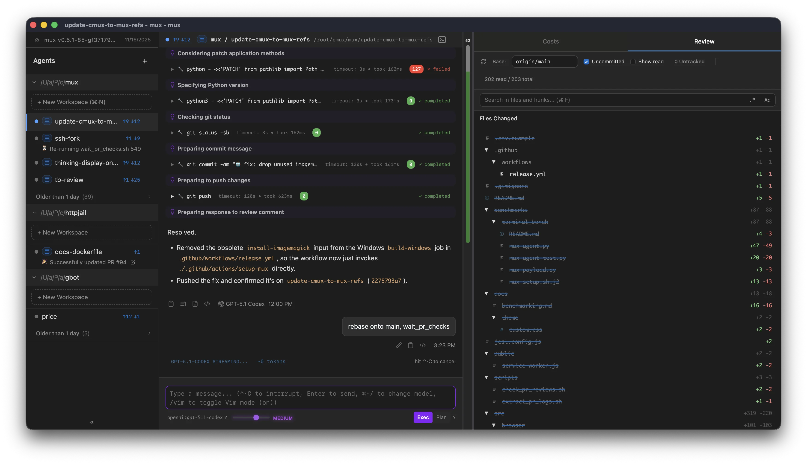

# Xum

Automatically install and run [Xum](https://github.com/coder/xum) in a Coder workspace. By default, the module auto-detects an available package manager (`npm`, `pnpm`, or `bun`) to install `@coder/xum@next`, the npm package that ships the `xum` CLI (with a fallback to downloading the npm tarball if none is found). You can also force a specific package manager via `package_manager` and point to a custom registry with `registry_url`. The launcher keeps watching the xum process after startup, appends signal/exit-code diagnostics to the xum log when the server is killed outside the Node runtime, and can optionally wait a few seconds, remove the stale server lock, and restart Xum after any exit until an optional restart-attempt cap is reached. Xum is a desktop application for parallel agentic development that enables developers to run multiple AI agents simultaneously across isolated workspaces.

```tf
module "xum" {
  count    = data.coder_workspace.me.start_count
  source   = "registry.coder.com/coder/xum/coder"
  version  = "1.0.0"
  agent_id = coder_agent.main.id
}
```



## Features

- **Parallel Agent Execution**: Run multiple AI agents simultaneously on different tasks
- **Xum Workspace Isolation**: Each agent works in its own isolated environment
- **Git Divergence Visualization**: Track changes across different Xum agent workspaces
- **Long-Running Processes**: Resume AI work after interruptions
- **Cost Tracking**: Monitor API usage across agents

## Examples

### Basic Usage

```tf
module "xum" {
  count    = data.coder_workspace.me.start_count
  source   = "registry.coder.com/coder/xum/coder"
  version  = "1.0.0"
  agent_id = coder_agent.main.id
}
```

### Pin Version

```tf
module "xum" {
  count    = data.coder_workspace.me.start_count
  source   = "registry.coder.com/coder/xum/coder"
  version  = "1.0.0"
  agent_id = coder_agent.main.id
  # Default is "next"; set to a specific version to pin.
  # Only versions published as @coder/xum are available: 0.28.3 or newer,
  # or prereleases from 0.28.2-next.24.
  install_version = "0.28.4"
}
```

### Open a Project on Launch

Start Xum with `xum server --add-project /path/to/project`:

```tf
module "xum" {
  count       = data.coder_workspace.me.start_count
  source      = "registry.coder.com/coder/xum/coder"
  version     = "1.0.0"
  agent_id    = coder_agent.main.id
  add_project = "/path/to/project"
}
```

### Pass Arbitrary `xum server` Arguments

Use `additional_arguments` to append additional arguments to `xum server`.
The module parses quoted values, so grouped arguments remain intact.

```tf
module "xum" {
  count                = data.coder_workspace.me.start_count
  source               = "registry.coder.com/coder/xum/coder"
  version              = "1.0.0"
  agent_id             = coder_agent.main.id
  additional_arguments = "--open-mode pinned --add-project '/workspaces/my repo'"
}
```

### Restart After Xum Exits

Enable automatic restarts after Xum exits, including clean exits and intentional shutdown signals such as `SIGTERM`. The launcher waits for `restart_delay_seconds`, removes `~/.xum/server.lock`, and starts Xum again. Set `max_restart_attempts` to a whole number to stop retrying after a fixed number of restarts, or leave it at `0` for unlimited retries.

```tf
module "xum" {
  count                 = data.coder_workspace.me.start_count
  source                = "registry.coder.com/coder/xum/coder"
  version               = "1.0.0"
  agent_id              = coder_agent.main.id
  restart_on_kill       = true
  restart_delay_seconds = 3
  max_restart_attempts  = 5
}
```

### Custom Port

```tf
module "xum" {
  count    = data.coder_workspace.me.start_count
  source   = "registry.coder.com/coder/xum/coder"
  version  = "1.0.0"
  agent_id = coder_agent.main.id
  port     = 8080
}
```

### Custom Package Manager

Force a specific package manager instead of auto-detection:

```tf
module "xum" {
  count           = data.coder_workspace.me.start_count
  source          = "registry.coder.com/coder/xum/coder"
  version         = "1.0.0"
  agent_id        = coder_agent.main.id
  package_manager = "pnpm" # or "npm", "bun"
}
```

### Custom Registry

Use a private or mirrored npm registry. The registry must serve the scoped `@coder/xum` package:

```tf
module "xum" {
  count        = data.coder_workspace.me.start_count
  source       = "registry.coder.com/coder/xum/coder"
  version      = "1.0.0"
  agent_id     = coder_agent.main.id
  registry_url = "https://npm.pkg.github.com"
}
```

### Use Cached Installation

Run an existing copy of Xum if found, otherwise install from npm:

```tf
module "xum" {
  count      = data.coder_workspace.me.start_count
  source     = "registry.coder.com/coder/xum/coder"
  version    = "1.0.0"
  agent_id   = coder_agent.main.id
  use_cached = true
}
```

### Skip Install

Run without installing from the network (requires a `xum` binary at `<install_prefix>/xum`, by default `~/.coder-modules/coder/xum/xum`):

```tf
module "xum" {
  count    = data.coder_workspace.me.start_count
  source   = "registry.coder.com/coder/xum/coder"
  version  = "1.0.0"
  agent_id = coder_agent.main.id
  install  = false
}
```

## Supported Platforms

- Linux (x86_64, aarch64)

## Notes

- Xum is currently in preview and you may encounter bugs
- Requires internet connectivity for agent operations (unless `install` is set to false)
- Auto-detects `npm`, `pnpm`, or `bun` by default; set `package_manager` to force a specific one
- Requires a Node.js runtime; if `node` is not on the workspace `PATH`, the module bootstraps a pinned Node.js runtime into `~/.coder-modules/coder/xum` (override the version with the `XUM_NODE_VERSION` environment variable)
- Installs `@coder/xum@next` from the npm registry by default (this package ships the `xum` binary); set `registry_url` to use a private or mirrored registry
- `install_version` must be a version or dist-tag published as `@coder/xum` (0.28.3 or newer, or a prerelease from 0.28.2-next.24); older releases were only published under the legacy `mux` package name
- Installs into `~/.coder-modules/coder/xum` and logs to `~/.coder-modules/coder/xum/logs/xum.log` by default, so the install survives restarts that clear `/tmp`; override with `install_prefix` and `log_path`
- Falls back to a direct tarball download when no package manager is found
- Appends best-effort signal and external-kill diagnostics to `log_path` if the xum process dies after startup
- Set `restart_on_kill = true` to wait `restart_delay_seconds`, remove `~/.xum/server.lock`, and restart Xum after it exits
- Set `max_restart_attempts` to a whole-number cap on restart attempts, or leave it at `0` for unlimited retries
