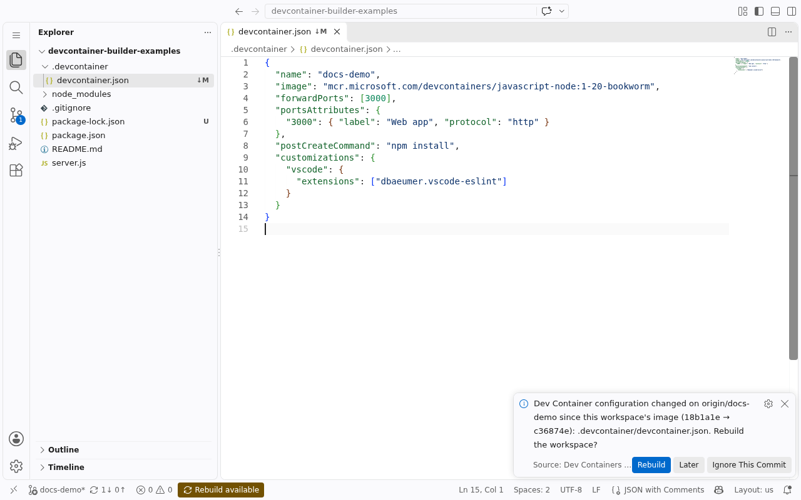

# Kubernetes (Dev Containers)

Workspaces built from a git repository's own `devcontainer.json`, on your Kubernetes
cluster. Enter a repository and a branch: the image is built from its Dev Container
configuration (base image, Features, Dockerfile) by
[devcontainer-builder](https://github.com/DeepSpaceCartel/devcontainer-builder), and the
workspace runs it with the configuration's lifecycle commands, environment, mounts,
forwarded ports, VS Code extensions and settings - like GitHub Codespaces, self-hosted.



## What you get

- **Any repository**: one with `.devcontainer/devcontainer.json` or `.devcontainer.json`
  builds from it; one without gets a generic image and an offer to add a configuration.
- **VS Code Desktop and VS Code in the browser** (Microsoft's VS Code Server, extensions
  from the Marketplace), opened on the cloned folder.
- **Persistence**: the home and the repository live on a per-workspace volume.
- **Rebuild**: the [Dev Containers for Coder in K8S](https://marketplace.visualstudio.com/items?itemName=deepspacecartel.devcontainer-builder)
  extension (installed in every workspace) offers to rebuild when the branch's Dev Container
  configuration changes, and clones repositories into new workspaces from a local VS Code.
- **Private repositories** with each user's own account (`external_auth_id`).
- **`hostRequirements`** are reserved on the node, as minimums.
- **Each workspace builds its own image tag**, so one workspace's rebuild never affects another.

## Prerequisites

This template calls services it does not deploy:

1. **devcontainer-builder** and a **BuildKit** daemon in the cluster - one Helm chart
   installs both:

   ```sh
   helm install devcontainer-builder oci://ghcr.io/deepspacecartel/charts/devcontainer-builder \
     --namespace devcontainer-builder --create-namespace \
     --set buildkit.deploy.enabled=true \
     --set registryAuth.registries[0].registry=ghcr.io \
     --set registryAuth.registries[0].username=<user> \
     --set registryAuth.registries[0].password=<token-with-write:packages>
   ```

2. A **registry** the cluster's nodes can pull the built images from (an image pull secret
   in the workspaces namespace if it's private).
3. A **namespace** for the workspaces.

See [Getting started](https://deepspacecartel.github.io/devcontainer-builder/) for the full
setup, and the [template guide](https://deepspacecartel.github.io/devcontainer-builder/guides/coder-workspace-template/)
for every `devcontainer.json` property it maps.

## Push the template

```sh
coder templates push kubernetes-devcontainer -d . \
  --var namespace=coder-workspaces \
  --var devcontainer_builder_endpoint=http://devcontainer-builder.devcontainer-builder.svc.cluster.local:8080
```

Optional variables: `image_pull_secret_name`, `external_auth_id` (e.g. `github`, for private
repositories), `max_cpu`/`max_memory`, `allow_privileged`, `accept_vscode_license`,
`max_forwarded_ports`, `subdomain_apps` (set `false` without a wildcard access URL),
`vscode_extension` - see `main.tf`.
