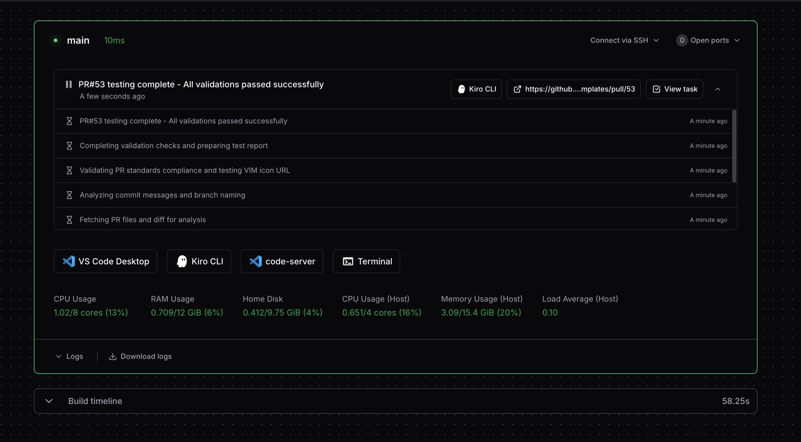

# Kiro CLI

Run [Kiro CLI](https://kiro.dev/) in your workspace to access AI coding assistant. This module provides a complete integration with Coder workspaces, including automatic installation, MCP (Model Context Protocol) integration for task reporting, and support for custom pre/post install scripts.

```tf
module "kiro-cli" {
  source   = "registry.coder.com/coder/kiro-cli/coder"
  version  = "1.0.0"
  agent_id = coder_agent.example.id
  workdir  = "/home/coder"

  # Required: Authentication tarball (see below for generation)
  auth_tarball = <<-EOF
base64encoded-tarball
EOF
}
```



## Prerequisites

- **zstd** - Required for compressing the authentication tarball
  - **Ubuntu/Debian**: `sudo apt-get install zstd`
  - **RHEL/CentOS/Fedora**: `sudo yum install zstd` or `sudo dnf install zstd`
- **auth_tarball** - Required for installation and authentication

### Authentication Tarball

You must generate an authenticated Kiro CLI tarball on another machine where you have successfully logged in:

```bash
# 1. Install Kiro CLI and login on your local machine
kiro-cli login

# 2. Generate the authentication tarball
cd ~/.local/share/kiro-cli
tar -c . | zstd | base64 -w 0
```

Copy the output and use it as the `auth_tarball` variable.

## Detailed Authentication Setup

**Step 1: Install Kiro CLI locally**

- Download from [Kiro CLI](https://kiro.dev/)
- Follow the installation instructions for your platform

**Step 2: Authenticate**

```bash
kiro-cli login
```

Complete the authentication process in your browser.

**Step 3: Generate tarball**

```bash
cd ~/.local/share/kiro-cli
tar -c . | zstd | base64 -w 0 > /tmp/kiro-cli-auth.txt
```

**Step 4: Use in Terraform**

```tf
variable "kiro_cli_auth_tarball" {
  type      = string
  sensitive = true
  default   = "PASTE_YOUR_TARBALL_HERE"
}
```

> [!IMPORTANT]
>
> - Regenerate the tarball if you logout or re-authenticate
> - Each user needs their own authentication tarball
> - Keep the tarball secure as it contains authentication credentials

### Coder Tasks Integration

A `coder_parameter` named **'AI Prompt'** is required to enable integration with [Coder Tasks](https://coder.com/docs/ai-coder/tasks).

```tf
data "coder_parameter" "ai_prompt" {
  name         = "AI Prompt"
  display_name = "AI Prompt"
  description  = "Prompt for the AI task to execute"
  type         = "string"
  mutable      = true
  default      = ""
}

module "kiro-cli" {
  source          = "registry.coder.com/coder/kiro-cli/coder"
  version         = "1.0.0"
  agent_id        = coder_agent.example.id
  workdir         = "/home/coder"
  auth_tarball    = var.kiro_cli_auth_tarball
  ai_prompt       = data.coder_parameter.ai_prompt.value
  trust_all_tools = true

  # Task reporting configuration
  report_tasks = true

  # Enable CLI app alongside web app
  cli_app              = true
  web_app_display_name = "Kiro CLI"
  cli_app_display_name = "Kiro CLI"
}
```

> [!IMPORTANT]
>
> - The parameter name must be exactly **'AI Prompt'** (case-sensitive)
> - This parameter enables the AI task workflow integration
> - The parameter value is passed to the Kiro CLI module via the `ai_prompt` variable
> - Without this parameter, `coder_ai_task` resources will not function properly
>
> **_Security Notice_**
> In order to allow the tasks flow non-interactively all the tools are trusted
> This flag bypasses standard permission checks and allows Kiro CLI broader access to your system than normally permitted.
> While this enables more functionality, it also means Kiro CLI can potentially execute commands with the same privileges as the user running it.
> Use this module only in trusted environments and be aware of the security implications.

### Default System Prompt

The module includes a simple system prompt that instructs Kiro CLI:

```
You are a helpful Coding assistant. Aim to autonomously investigate
and solve issues the user gives you and test your work, whenever possible.
Avoid shortcuts like mocking tests. When you get stuck, you can ask the user
but opt for autonomy.
```

You can customize this behavior by providing your own system prompt via the `system_prompt` variable.

### Default Coder MCP Instructions

The module includes specific instructions for the Coder MCP server integration that are separate from the system prompt:

```
YOU MUST REPORT ALL TASKS TO CODER.
When reporting tasks you MUST follow these EXACT instructions:
- IMMEDIATELY report status after receiving ANY user message
- Be granular If you are investigating with multiple steps report each step to coder.

Task state MUST be one of the following:
- Use "state": "working" when actively processing WITHOUT needing additional user input
- Use "state": "complete" only when finished with a task
- Use "state": "failure" when you need ANY user input lack sufficient details or encounter blockers.

Task summaries MUST:
- Include specifics about what you're doing
- Include clear and actionable steps for the user
- Be less than 160 characters in length
```

You can customize these instructions by providing your own via the `coder_mcp_instructions` variable.

## Default Agent Configuration

The module includes a default agent configuration template that provides a comprehensive setup for Kiro CLI integration:

```json
{
  "name": "agent",
  "description": "This is an default agent config",
  "prompt": "${system_prompt}",
  "mcpServers": {},
  "tools": ["read", "write", "shell", "aws", "@coder", "knowledge"],
  "toolAliases": {},
  "allowedTools": ["read", "@coder"],
  "resources": [
    "file://KiroQ.md",
    "file://README.md",
    "file://.kiro/steering/**/*.md"
  ],
  "hooks": {},
  "toolsSettings": {},
  "useLegacyMcpJson": true
}
```

### Configuration Details:

- **Tools Available:** File operations (`read`, `write`), shell execution (`shell`), AWS CLI (`aws`), Coder MCP integration (`@coder`), and knowledge base access (`knowledge`)
- **@coder Tool:** Enables Coder MCP integration for task reporting (`coder_report_task` and related tools)
- **Allowed Tools:** By default, only `read` and `@coder` are allowed (can be customized for security)
- **Resources:** Access to documentation and rule files in the workspace
- **MCP Servers:** Empty by default, can be configured via `agent_config` variable
- **System Prompt:** Dynamically populated from the `system_prompt` variable
- **Legacy MCP:** Uses legacy MCP JSON format for compatibility

You can override this configuration by providing your own JSON via the `agent_config` variable.

### Agent Name Configuration

The module automatically extracts the agent name from the `"name"` field in the `agent_config` JSON and uses it for:

- **Configuration File:** Saves the agent config as `~/.kiro/agents/{agent_name}.json`
- **Default Agent:** Sets the agent as the default using `q settings chat.defaultAgent {agent_name}`
- **MCP Integration:** Associates the Coder MCP server with the specified agent name

If no custom `agent_config` is provided, the default agent name "agent" is used.

## Usage Examples

### Basic Usage

```tf
module "kiro-cli" {
  source       = "registry.coder.com/coder/kiro-cli/coder"
  version      = "1.0.0"
  agent_id     = coder_agent.example.id
  workdir      = "/home/coder"
  auth_tarball = var.kiro_cli_auth_tarball
}
```

This example will:

1. Download and install Kiro CLI latest version
2. Extract authentication tarball to ~/.local/share/kiro-cli
3. Configure Coder MCP integration for task reporting
4. Create default agent configuration file
5. Start Kiro CLI in /home/coder directory
6. Provide web interface through AgentAPI

> [!IMPORTANT]
> By default `write` tool is not allowed, which will pause the task execution
> an will wait for the prompt to approve it usage.
> To avoid this, and allow the normal task flow, user has two options:
>
> - Change the parameter `trust_all_tools` value to `true` (default to `false`)
>   OR
> - Provide you own agent configuration with the tools of your choice allowed

### With Custom AI Prompt

```tf
module "kiro-cli" {
  source          = "registry.coder.com/coder/kiro-cli/coder"
  version         = "1.0.0"
  agent_id        = coder_agent.example.id
  workdir         = "/home/coder"
  auth_tarball    = var.kiro_cli_auth_tarball
  ai_prompt       = "Help me set up a Python FastAPI project with proper testing structure"
  trust_all_tools = true
}
```

> [!IMPORTANT]
> **_Security Notice_**
> In order to allow the tasks flow non-interactively all the tools are trusted
> This flag bypasses standard permission checks and allows Kiro CLI broader access to your system than normally permitted.
> While this enables more functionality, it also means Kiro CLI can potentially execute commands with the same privileges as the user running it.
> Use this module only in trusted environments and be aware of the security implications.

### With Custom Pre/Post Install Scripts

```tf
module "kiro-cli" {
  source       = "registry.coder.com/coder/kiro-cli/coder"
  version      = "1.0.0"
  agent_id     = coder_agent.example.id
  workdir      = "/home/coder"
  auth_tarball = var.kiro_cli_auth_tarball

  pre_install_script = <<-EOT
    #!/bin/bash
    echo "Setting up custom environment..."
    # Install additional dependencies
    sudo apt-get update && sudo apt-get install -y zstd
  EOT

  post_install_script = <<-EOT
    #!/bin/bash
    echo "Configuring Kiro CLI settings..."
    # Custom configuration commands
    kiro-cli settings chat.model claude-3-sonnet
  EOT
}
```

### Specific Version Installation

```tf
module "kiro-cli" {
  source           = "registry.coder.com/coder/kiro-cli/coder"
  version          = "1.0.0"
  agent_id         = coder_agent.example.id
  workdir          = "/home/coder"
  auth_tarball     = var.kiro_cli_auth_tarball
  kiro_cli_version = "1.14.0" # Specific version
  install_kiro_cli = true
}
```

### Custom Agent Configuration

```tf
module "kiro-cli" {
  source       = "registry.coder.com/coder/kiro-cli/coder"
  version      = "1.0.0"
  agent_id     = coder_agent.example.id
  workdir      = "/home/coder"
  auth_tarball = var.kiro_cli_auth_tarball

  agent_config = <<-EOT
    {
      "name": "custom-agent",
      "description": "Custom Kiro CLI agent for my workspace",
      "prompt": "You are a specialized DevOps assistant...",
      "tools": ["read", "write", "shell", "aws"]
    }
  EOT
}
```

### With Custom AgentAPI Configuration

```tf
module "kiro-cli" {
  source       = "registry.coder.com/coder/kiro-cli/coder"
  version      = "1.0.0"
  agent_id     = coder_agent.example.id
  workdir      = "/home/coder"
  auth_tarball = var.kiro_cli_auth_tarball

  # AgentAPI configuration for environments without wildcard access url. https://coder.com/docs/admin/setup#wildcard-access-url
  agentapi_chat_based_path = true
  agentapi_version         = "v0.10.0"
}
```

### Air-Gapped Installation

For environments without direct internet access, you can host Kiro CLI installation files internally and configure the module to use your internal repository:

```tf
module "kiro-cli" {
  source       = "registry.coder.com/coder/kiro-cli/coder"
  version      = "1.0.0"
  agent_id     = coder_agent.example.id
  workdir      = "/home/coder"
  auth_tarball = var.kiro_cli_auth_tarball

  # Point to internal artifact repository
  kiro_install_url = "https://artifacts.internal.corp/kiro-cli-releases"

  # Use specific version available in your repository
  kiro_cli_version = "latest"
}
```

**Prerequisites for Air-Gapped Setup:**

1. Download Kiro CLI installation files from the official source and host them internally
2. Maintain the same directory structure: `{base_url}/{version}/kirocli-{arch}-linux.zip`
3. Ensure both architectures are available:
   - `kirocli-x86_64-linux.zip` for Intel/AMD systems
   - `kirocli-aarch64-linux.zip` for ARM systems
4. Configure network access from Coder workspaces to your internal repository

## Troubleshooting

### Common Issues

**Authentication issues:**

- Regenerate the auth tarball on your local machine
- Ensure the tarball is properly base64 encoded
- Check that the original authentication is still valid

**MCP integration not working:**

- Verify that AgentAPI is installed (`install_agentapi = true`)
- Check that the Coder agent is properly configured
- Review the system prompt configuration

<!-- BEGIN_TF_DOCS -->

## Requirements

| Name                                                                     | Version |
| ------------------------------------------------------------------------ | ------- |
| <a name="requirement_terraform"></a> [terraform](#requirement_terraform) | >= 1.0  |
| <a name="requirement_coder"></a> [coder](#requirement_coder)             | >= 2.12 |

## Providers

| Name                                                   | Version |
| ------------------------------------------------------ | ------- |
| <a name="provider_coder"></a> [coder](#provider_coder) | 2.13.1  |

## Modules

| Name                                                        | Source                                  | Version |
| ----------------------------------------------------------- | --------------------------------------- | ------- |
| <a name="module_agentapi"></a> [agentapi](#module_agentapi) | registry.coder.com/coder/agentapi/coder | 2.0.0   |

## Resources

| Name                                                                                                                     | Type        |
| ------------------------------------------------------------------------------------------------------------------------ | ----------- |
| [coder_env.auth_tarball](https://registry.terraform.io/providers/coder/coder/latest/docs/resources/env)                  | resource    |
| [coder_env.status_slug](https://registry.terraform.io/providers/coder/coder/latest/docs/resources/env)                   | resource    |
| [coder_workspace.me](https://registry.terraform.io/providers/coder/coder/latest/docs/data-sources/workspace)             | data source |
| [coder_workspace_owner.me](https://registry.terraform.io/providers/coder/coder/latest/docs/data-sources/workspace_owner) | data source |

## Inputs

| Name                                                                                                      | Description                                                                                                                                                      | Type     | Default                                                                                                                                                                                                                                                                                                                                                                                                                                                                                                                                                                                                                                                                                                                                          | Required |
| --------------------------------------------------------------------------------------------------------- | ---------------------------------------------------------------------------------------------------------------------------------------------------------------- | -------- | ------------------------------------------------------------------------------------------------------------------------------------------------------------------------------------------------------------------------------------------------------------------------------------------------------------------------------------------------------------------------------------------------------------------------------------------------------------------------------------------------------------------------------------------------------------------------------------------------------------------------------------------------------------------------------------------------------------------------------------------------ | :------: |
| <a name="input_agent_config"></a> [agent_config](#input_agent_config)                                     | Optional Agent configuration JSON for Kiro CLI.                                                                                                                  | `string` | `null`                                                                                                                                                                                                                                                                                                                                                                                                                                                                                                                                                                                                                                                                                                                                           |    no    |
| <a name="input_agent_id"></a> [agent_id](#input_agent_id)                                                 | The ID of a Coder agent.                                                                                                                                         | `string` | n/a                                                                                                                                                                                                                                                                                                                                                                                                                                                                                                                                                                                                                                                                                                                                              |   yes    |
| <a name="input_agentapi_chat_based_path"></a> [agentapi_chat_based_path](#input_agentapi_chat_based_path) | Whether to use chat-based path for AgentAPI.Required if CODER_WILDCARD_ACCESS_URL is not defined in coder deployment                                             | `bool`   | `false`                                                                                                                                                                                                                                                                                                                                                                                                                                                                                                                                                                                                                                                                                                                                          |    no    |
| <a name="input_agentapi_version"></a> [agentapi_version](#input_agentapi_version)                         | The version of AgentAPI to install.                                                                                                                              | `string` | `"v0.10.0"`                                                                                                                                                                                                                                                                                                                                                                                                                                                                                                                                                                                                                                                                                                                                      |    no    |
| <a name="input_ai_prompt"></a> [ai_prompt](#input_ai_prompt)                                              | The initial task prompt to send to Kiro CLI.                                                                                                                     | `string` | `""`                                                                                                                                                                                                                                                                                                                                                                                                                                                                                                                                                                                                                                                                                                                                             |    no    |
| <a name="input_auth_tarball"></a> [auth_tarball](#input_auth_tarball)                                     | Base64 encoded, zstd compressed tarball of a pre-authenticated ~/.local/share/kiro-cli directory.                                                                | `string` | `""`                                                                                                                                                                                                                                                                                                                                                                                                                                                                                                                                                                                                                                                                                                                                             |    no    |
| <a name="input_cli_app"></a> [cli_app](#input_cli_app)                                                    | Whether to create a CLI app for Kiro CLI                                                                                                                         | `bool`   | `false`                                                                                                                                                                                                                                                                                                                                                                                                                                                                                                                                                                                                                                                                                                                                          |    no    |
| <a name="input_cli_app_display_name"></a> [cli_app_display_name](#input_cli_app_display_name)             | Display name for the CLI app                                                                                                                                     | `string` | `"Kiro CLI"`                                                                                                                                                                                                                                                                                                                                                                                                                                                                                                                                                                                                                                                                                                                                     |    no    |
| <a name="input_coder_mcp_instructions"></a> [coder_mcp_instructions](#input_coder_mcp_instructions)       | Instructions for the Coder MCP server integration. This defines how the agent should report tasks to Coder.                                                      | `string` | `"YOU MUST REPORT ALL TASKS TO CODER.\nWhen reporting tasks you MUST follow these EXACT instructions:\n- IMMEDIATELY report status after receiving ANY user message\n- Be granular If you are investigating with multiple steps report each step to coder.\n\nTask state MUST be one of the following:\n- Use \"state\": \"working\" when actively processing WITHOUT needing additional user input\n- Use \"state\": \"complete\" only when finished with a task\n- Use \"state\": \"failure\" when you need ANY user input lack sufficient details or encounter blockers.\n\nTask summaries MUST:\n- Include specifics about what you're doing\n- Include clear and actionable steps for the user\n- Be less than 160 characters in length\n"` |    no    |
| <a name="input_group"></a> [group](#input_group)                                                          | The name of a group that this app belongs to.                                                                                                                    | `string` | `null`                                                                                                                                                                                                                                                                                                                                                                                                                                                                                                                                                                                                                                                                                                                                           |    no    |
| <a name="input_icon"></a> [icon](#input_icon)                                                             | The icon to use for the app.                                                                                                                                     | `string` | `"/icon/kiro.svg"`                                                                                                                                                                                                                                                                                                                                                                                                                                                                                                                                                                                                                                                                                                                               |    no    |
| <a name="input_install_agentapi"></a> [install_agentapi](#input_install_agentapi)                         | Whether to install AgentAPI.                                                                                                                                     | `bool`   | `true`                                                                                                                                                                                                                                                                                                                                                                                                                                                                                                                                                                                                                                                                                                                                           |    no    |
| <a name="input_install_kiro_cli"></a> [install_kiro_cli](#input_install_kiro_cli)                         | Whether to install Kiro CLI.                                                                                                                                     | `bool`   | `true`                                                                                                                                                                                                                                                                                                                                                                                                                                                                                                                                                                                                                                                                                                                                           |    no    |
| <a name="input_kiro_cli_version"></a> [kiro_cli_version](#input_kiro_cli_version)                         | The version of Kiro CLI to install.                                                                                                                              | `string` | `"latest"`                                                                                                                                                                                                                                                                                                                                                                                                                                                                                                                                                                                                                                                                                                                                       |    no    |
| <a name="input_kiro_install_url"></a> [kiro_install_url](#input_kiro_install_url)                         | Base URL for Kiro CLI installation downloads.                                                                                                                    | `string` | `"https://desktop-release.q.us-east-1.amazonaws.com"`                                                                                                                                                                                                                                                                                                                                                                                                                                                                                                                                                                                                                                                                                            |    no    |
| <a name="input_order"></a> [order](#input_order)                                                          | The order determines the position of app in the UI presentation. The lowest order is shown first and apps with equal order are sorted by name (ascending order). | `number` | `null`                                                                                                                                                                                                                                                                                                                                                                                                                                                                                                                                                                                                                                                                                                                                           |    no    |
| <a name="input_post_install_script"></a> [post_install_script](#input_post_install_script)                | Optional script to run after installing Kiro CLI.                                                                                                                | `string` | `null`                                                                                                                                                                                                                                                                                                                                                                                                                                                                                                                                                                                                                                                                                                                                           |    no    |
| <a name="input_pre_install_script"></a> [pre_install_script](#input_pre_install_script)                   | Optional script to run before installing Kiro CLI.                                                                                                               | `string` | `null`                                                                                                                                                                                                                                                                                                                                                                                                                                                                                                                                                                                                                                                                                                                                           |    no    |
| <a name="input_report_tasks"></a> [report_tasks](#input_report_tasks)                                     | Whether to enable task reporting to Coder UI via AgentAPI                                                                                                        | `bool`   | `true`                                                                                                                                                                                                                                                                                                                                                                                                                                                                                                                                                                                                                                                                                                                                           |    no    |
| <a name="input_system_prompt"></a> [system_prompt](#input_system_prompt)                                  | The system prompt to use for Kiro CLI. This should instruct the agent how to do task reporting.                                                                  | `string` | `"You are a helpful Coding assistant. Aim to autonomously investigate\nand solve issues the user gives you and test your work, whenever possible.\nAvoid shortcuts like mocking tests. When you get stuck, you can ask the user\nbut opt for autonomy.\n"`                                                                                                                                                                                                                                                                                                                                                                                                                                                                                       |    no    |
| <a name="input_trust_all_tools"></a> [trust_all_tools](#input_trust_all_tools)                            | Whether to trust all tools in Kiro CLI.                                                                                                                          | `bool`   | `false`                                                                                                                                                                                                                                                                                                                                                                                                                                                                                                                                                                                                                                                                                                                                          |    no    |
| <a name="input_web_app_display_name"></a> [web_app_display_name](#input_web_app_display_name)             | Display name for the web app                                                                                                                                     | `string` | `"Kiro CLI"`                                                                                                                                                                                                                                                                                                                                                                                                                                                                                                                                                                                                                                                                                                                                     |    no    |
| <a name="input_workdir"></a> [workdir](#input_workdir)                                                    | The folder to run Kiro CLI in.                                                                                                                                   | `string` | n/a                                                                                                                                                                                                                                                                                                                                                                                                                                                                                                                                                                                                                                                                                                                                              |   yes    |

## Outputs

| Name                                                                 | Description |
| -------------------------------------------------------------------- | ----------- |
| <a name="output_task_app_id"></a> [task_app_id](#output_task_app_id) | n/a         |

<!-- END_TF_DOCS -->
