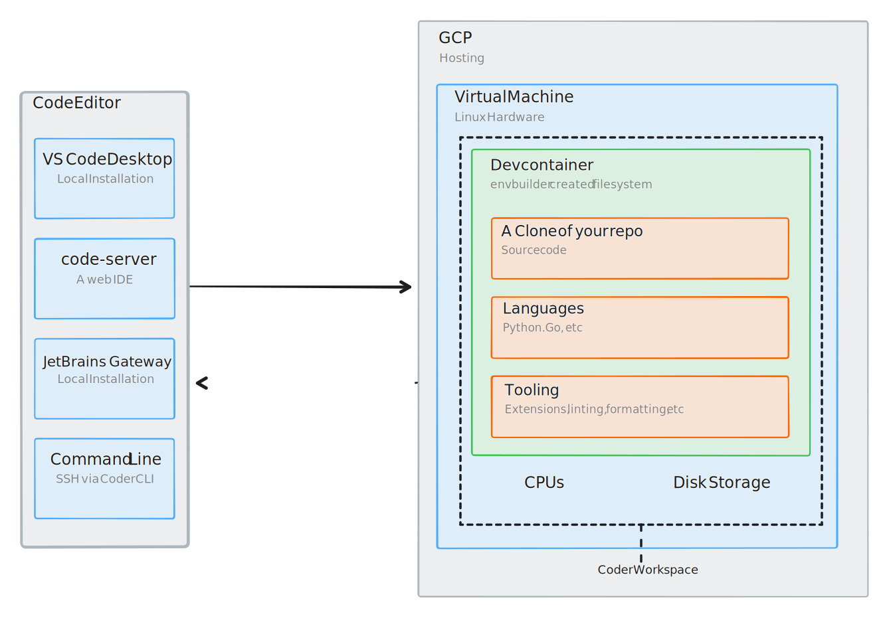

# Remote Development in a Devcontainer on Google Compute Engine

## Prerequisites

### Authentication

This template assumes that coderd is run in an environment that is authenticated
with Google Cloud. For example, run `gcloud auth application-default login` to
import credentials on the system and user running coderd. For other ways to
authenticate [consult the Terraform
docs](https://registry.terraform.io/providers/hashicorp/google/latest/docs/guides/getting_started#adding-credentials).

Coder requires a Google Cloud Service Account to provision workspaces. To create
a service account:

1. Navigate to the [CGP
   console](https://console.cloud.google.com/projectselector/iam-admin/serviceaccounts/create),
   and select your Cloud project (if you have more than one project associated
   with your account)

1. Provide a service account name (this name is used to generate the service
   account ID)

1. Click **Create and continue**, and choose the following IAM roles to grant to
   the service account:
   - Compute Admin
   - Service Account User

   Click **Continue**.

1. Click on the created key, and navigate to the **Keys** tab.

1. Click **Add key** > **Create new key**.

1. Generate a **JSON private key**, which will be what you provide to Coder
   during the setup process.

## Architecture

This template provisions the following resources:

- Envbuilder cached image (conditional, persistent) using [`terraform-provider-envbuilder`](https://github.com/coder/terraform-provider-envbuilder)
- GCP VM (persistent) with a running Docker daemon
- GCP Disk (persistent, mounted to root)
- [Envbuilder container](https://github.com/coder/envbuilder) inside the GCP VM

Coder persists the root volume. The full filesystem is preserved when the workspace restarts.
When the GCP VM starts, a startup script runs that ensures a running Docker daemon, and starts
an Envbuilder container using this Docker daemon. The Docker socket is also mounted inside the container to allow running Docker containers inside the workspace.

> **Note**
> This template is designed to be a starting point! Edit the Terraform to extend the template to support your use case.

## Caching

To speed up your builds, you can use a container registry as a cache.
When creating the template, set the parameter `cache_repo` to a valid Docker repository in the form `host.tld/path/to/repo`.

See the [Envbuilder Terraform Provider Examples](https://github.com/coder/terraform-provider-envbuilder/blob/main/examples/resources/envbuilder_cached_image/envbuilder_cached_image_resource.tf/) for a more complete example of how the provider works.

> [!NOTE]
> We recommend using a registry cache with authentication enabled.
> To allow Envbuilder to authenticate with the registry cache, specify the variable `cache_repo_docker_config_path`
> with the path to a Docker config `.json` on disk containing valid credentials for the registry.

## code-server

`code-server` is installed via the [`code-server`](https://registry.coder.com/modules/code-server) registry module. Please check [Coder Registry](https://registry.coder.com) for a list of all modules and templates.
