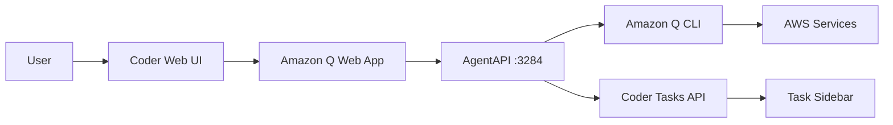

# Amazon Q with Coder Tasks Integration

Run [Amazon Q](https://aws.amazon.com/q/) with [AgentAPI](https://github.com/coder/agentapi) and full [Coder Tasks](https://coder.com/docs/tasks) support. This module provides a modern web chat interface with real-time task reporting, making it easy to track AI progress through Coder's task sidebar.

```tf
module "amazon-q" {
  source                  = "registry.coder.com/saheli/amazon-q/coder"
  version                 = "2.0.0"
  agent_id                = coder_agent.example.id
  experiment_report_tasks = true # Enable Coder Tasks integration

  # AWS Authentication
  aws_access_key_id     = var.aws_access_key_id
  aws_secret_access_key = var.aws_secret_access_key
}
```


## Features

- 🤖 **Amazon Q Integration**: Full Amazon Q Developer capabilities
- 📊 **Coder Tasks**: Real-time task reporting in the Coder sidebar
- 🌐 **Web Chat Interface**: Modern web UI powered by AgentAPI
- 🎯 **Aider Support**: Optional Aider integration for enhanced coding
- 🔌 **MCP Protocol**: Model Context Protocol for advanced integrations
- 🔐 **Flexible Auth**: Supports AWS credentials, IAM roles, and SSO

## Prerequisites

- Coder v2.7.0 or later
- AWS account with Amazon Q Developer access
- Linux workspace (x86_64 or arm64)

## Quick Start

### Basic Usage with Tasks

```hcl
module "amazon-q" {
  source  = "registry.coder.com/saheli/amazon-q/coder"
  version = "2.0.0"

  agent_id = coder_agent.main.id

  # Enable Coder Tasks
  experiment_report_tasks = true

  # AWS credentials
  aws_access_key_id     = var.aws_access_key_id
  aws_secret_access_key = var.aws_secret_access_key
  aws_region           = "us-east-1"
}
```

### With Custom Task Reporting

```hcl
module "amazon-q" {
  source  = "registry.coder.com/saheli/amazon-q/coder"
  version = "2.0.0"

  agent_id = coder_agent.main.id
  experiment_report_tasks = true

  # Optimized system prompt for task reporting
  system_prompt = <<-EOT
    You are Amazon Q integrated with Coder Tasks.

    YOU MUST REPORT ALL TASKS TO CODER:
    - Report status IMMEDIATELY after any user message
    - Break work into granular, trackable tasks
    - Use "working" when actively processing
    - Use "complete" when finished
    - Use "failure" when blocked

    Keep summaries under 160 characters.
  EOT

  # Start with a specific task
  task_prompt = "Create a Python REST API with FastAPI"
}
```

### Using Aider Mode

```hcl
module "amazon-q" {
  source  = "registry.coder.com/saheli/amazon-q/coder"
  version = "2.0.0"

  agent_id = coder_agent.main.id

  # Use Aider instead of Amazon Q CLI
  use_aider = true
  aider_version = "latest"

  # Enable all features
  experiment_report_tasks = true
  install_agentapi = true
}
```

## How Coder Tasks Integration Works

When `experiment_report_tasks = true`:

1. **Web Interface**: Access Amazon Q through the "Amazon Q Web" app in Coder
2. **Task Sidebar**: Tasks appear in real-time in the Coder sidebar
3. **Status Updates**: See live progress as the AI works on your requests
4. **MCP Protocol**: Uses Model Context Protocol for reliable task reporting

The integration provides:

- Real-time task status (working, complete, failure)
- Granular progress tracking
- Interactive chat interface
- Full task history

## Configuration Variables

| Variable                  | Type   | Description                       | Default                |
| ------------------------- | ------ | --------------------------------- | ---------------------- |
| `agent_id`                | string | **Required** - The Coder agent ID | -                      |
| `experiment_report_tasks` | bool   | Enable Coder Tasks integration    | `true`                 |
| `install_amazon_q`        | bool   | Install Amazon Q CLI              | `true`                 |
| `install_agentapi`        | bool   | Install AgentAPI                  | `true`                 |
| `use_aider`               | bool   | Use Aider instead of Amazon Q     | `false`                |
| `system_prompt`           | string | System instructions for the AI    | (task-optimized)       |
| `task_prompt`             | string | Initial task to start with        | `""`                   |
| `aws_access_key_id`       | string | AWS Access Key ID                 | `""`                   |
| `aws_secret_access_key`   | string | AWS Secret Access Key             | `""`                   |
| `aws_region`              | string | AWS Region                        | `"us-east-1"`          |
| `order`                   | number | App display order                 | `null`                 |
| `group`                   | string | App group name                    | `null`                 |
| `icon`                    | string | App icon path                     | `"/icon/amazon-q.svg"` |

## AWS Authentication

The module supports multiple authentication methods:

### 1. Environment Variables

```hcl
aws_access_key_id     = var.aws_access_key_id
aws_secret_access_key = var.aws_secret_access_key
```

### 2. IAM Instance Role

Leave credentials empty to use the workspace's IAM role.

### 3. AWS Profile

```hcl
aws_profile = "my-profile"
```

## Advanced Configuration

### Custom MCP Extensions

Add additional MCP servers for enhanced functionality:

```hcl
additional_extensions = <<-YAML
desktop-commander:
  cmd: desktop-commander-server
  args: ["--server"]
  description: Long-running processes
  enabled: true
  type: stdio
playwright:
  cmd: npx
  args: ["--yes", "@mcp-get/playwright", "server"]
  description: Web testing
  enabled: true
  type: stdio
YAML
```

### Custom Scripts

Run scripts before/after installation:

```hcl
experiment_pre_install_script = <<-BASH
  echo "Preparing environment..."
  pip install -U pip
BASH

experiment_post_install_script = <<-BASH
  echo "Setup complete!"
BASH
```

## Troubleshooting

### Task Reporting Issues

- Ensure `experiment_report_tasks = true`
- Check AgentAPI status: `curl http://localhost:3284/status`
- Verify MCP config: `cat ~/.config/coder/mcp/amazon-q.yaml`
- Check logs: `tail -f ~/.amazon-q-module/logs/*.log`

### Amazon Q Not Starting

- Verify installation: `q --version`
- Check AWS credentials: `aws sts get-caller-identity`
- Review logs in `~/.amazon-q-module/logs/`

### Web Interface Not Loading

- Ensure AgentAPI is running on port 3284
- Check the "Amazon Q Web" app in Coder UI
- Verify health check passes

## Architecture



## Support

- [Amazon Q Documentation](https://docs.aws.amazon.com/amazonq/)
- [Coder Tasks Guide](https://coder.com/docs/tasks)
- [AgentAPI Repository](https://github.com/coder/agentapi)
- [Module Issues](https://github.com/coder/registry/issues)

## License

This module is licensed under the MIT License. Amazon Q is subject to AWS service terms.
