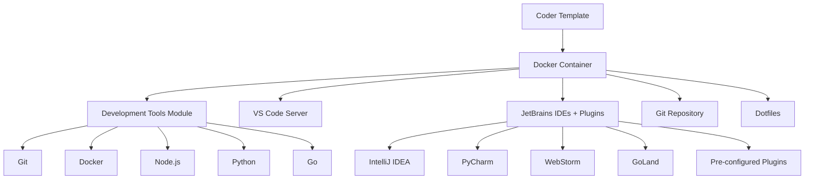

# Full-Stack Developer Workstation

A comprehensive, containerized development environment that showcases modern development tooling with intelligent configuration. This template demonstrates advanced module integration including plugin pre-configuration for JetBrains IDEs and automatic development tools installation.


## 🚀 Features

### **Intelligent Module Integration**
✅ **Smart tool selection** - Choose development tools and IDEs via UI parameters  
✅ **Automatic plugin configuration** - JetBrains plugins configured based on selected tools  
✅ **Multi-editor support** - VS Code + JetBrains IDEs with synchronized configurations  
✅ **Repository integration** - Clone and configure any Git repository  
✅ **Environment personalization** - Dotfiles support for custom configurations

### **Advanced Development Tools**
✅ **Container-based** - Docker development with volume persistence  
✅ **Language support** - Python, Node.js, Go, PHP, Ruby, Rust, C/C++  
✅ **Database tools** - Built-in support for various database connections  
✅ **DevOps tools** - Docker, Kubernetes, and CI/CD integrations

### **Showcase Modules**
- **🔧 [`saheli/dev-tools`](registry.coder.com/saheli/dev-tools)** - Development tools installer
- **🎯 [`saheli/jetbrains-plugins`](registry.coder.com/saheli/jetbrains-plugins)** - JetBrains with plugin pre-configuration
- **📝 [`coder/code-server`](registry.coder.com/coder/code-server)** - VS Code in the browser
- **📁 [`coder/git-clone`](registry.coder.com/coder/git-clone)** - Repository cloning
- **🏠 [`coder/dotfiles`](registry.coder.com/coder/dotfiles)** - Environment personalization

## 🏗️ Architecture



## 📋 Template Parameters

### **Container Image Selection**
Choose from optimized development images:
- **Ubuntu (Latest)** - Clean Ubuntu base for general development
- **Node.js** - Pre-configured with Node.js and npm
- **Python** - Python 3 with pip and development tools
- **Go** - Go runtime with standard library

### **Development Tools**
Select tools to install automatically:
- **Git** - Version control with bash completion
- **Docker** - Container runtime with socket access
- **Node.js** - JavaScript runtime with npm
- **Python** - Python 3 with pip, venv, and dev tools
- **Go** - Go programming language with PATH setup

### **JetBrains IDEs**
Configure JetBrains development environments:
- **IntelliJ IDEA Ultimate** - Java and multi-language development
- **PyCharm Professional** - Python-focused development
- **WebStorm** - JavaScript and web development
- **GoLand** - Go development environment
- **PhpStorm** - PHP development
- **Rider** - .NET development
- **CLion** - C/C++ development
- **RubyMine** - Ruby development
- **RustRover** - Rust development

### **Repository Integration**
- **Repository URL** - Optional Git repository to clone and configure

## ⚡ Intelligent Plugin Configuration

The template automatically configures JetBrains plugins based on your tool selections:

| Selected Tools | Auto-Configured Plugins |
|----------------|-------------------------|
| **All configurations** | GitHub integration, AI Assistant, Markdown support |
| **Python** | Python language support for IntelliJ |
| **Go** | Go language support and tools |
| **Node.js** | JavaScript support, Vue.js integration |
| **Docker** | Docker integration and Dockerfile support |

## 🔧 Usage Examples

### Example 1: Full-Stack JavaScript Developer

```tf
resource "coder_template" "full-stack-js" {
  name        = "full-stack-js"
  description = "JavaScript development with React/Node.js"
  
  # Template will configure:
  # - Node.js development tools
  # - WebStorm with JavaScript plugins
  # - VS Code with Node.js extensions
  # - Docker for containerized development
}
```

**User selections:**
- Container: Node.js
- Tools: Git, Node.js, Docker
- IDEs: WebStorm, IntelliJ IDEA
- Repository: `https://github.com/user/react-project`

**Result:** Complete React/Node.js environment with pre-configured plugins and tools.

### Example 2: Python Data Science Workstation

```tf
resource "coder_template" "python-datascience" {
  name        = "python-datascience"
  description = "Python development for data science and ML"
}
```

**User selections:**
- Container: Python
- Tools: Git, Python, Docker
- IDEs: PyCharm Professional
- Repository: `https://github.com/user/ml-project`

**Result:** Python environment with PyCharm configured for data science development.

### Example 3: Multi-Language Development

```tf
resource "coder_template" "polyglot-dev" {
  name        = "polyglot-dev"
  description = "Multi-language development environment"
}
```

**User selections:**
- Container: Ubuntu (Latest)
- Tools: Git, Docker, Node.js, Python, Go
- IDEs: IntelliJ IDEA, PyCharm, GoLand
- Repository: `https://github.com/user/microservices`

**Result:** Complete polyglot development setup with all tools and appropriate IDE plugins.

## 🛠️ Module Integration Details

### Development Tools Module (`saheli/dev-tools`)

```tf
module "dev_tools" {
  count    = data.coder_workspace.me.start_count
  source   = "registry.coder.com/saheli/dev-tools/coder"
  version  = "~> 1.0"
  agent_id = coder_agent.main.id
  
  tools = jsondecode(data.coder_parameter.dev_tools.value)
  user  = local.username
}
```

**Features:**
- Smart detection of existing installations
- Parallel installation for faster setup
- Detailed logging with timestamps
- User-specific configurations

### JetBrains with Plugins Module (`saheli/jetbrains-plugins`)

```tf
module "jetbrains_with_plugins" {
  count    = data.coder_workspace.me.start_count
  source   = "registry.coder.com/saheli/jetbrains-plugins/coder"
  version  = "~> 1.0"
  agent_id = coder_agent.main.id
  folder   = "/workspace/project"
  
  default = jsondecode(data.coder_parameter.jetbrains_ides.value)
  plugins = local.jetbrains_plugins  # Intelligent plugin selection
  
  order = 2
}
```

**Plugin Intelligence:**
- Analyzes selected development tools
- Automatically includes relevant language plugins
- Configures IDE settings for optimal experience
- Creates project-level plugin dependencies

### VS Code Integration

```tf
module "code_server" {
  count    = data.coder_workspace.me.start_count
  source   = "registry.coder.com/coder/code-server/coder"
  version  = "~> 1.0"
  agent_id = coder_agent.main.id
  
  extensions = [/* Tool-specific extensions */]
  order = 1
}
```

**Extension Intelligence:**
- Matches VS Code extensions with selected tools
- Provides consistent experience across editors
- Optimizes for selected programming languages

## 🔒 Security & Best Practices

### Container Security
- **Non-root user** - Runs as workspace user
- **Volume isolation** - Persistent home directory
- **Network isolation** - Container networking with host access
- **Resource limits** - CPU and memory constraints

### Development Security
- **Docker socket** - Secure Docker-in-Docker development
- **Git credentials** - Secure credential management
- **Plugin validation** - Only verified plugins auto-configured

## 📊 Resource Usage

| Component | CPU | Memory | Disk |
|-----------|-----|--------|------|
| Base Container | 0.1 cores | 512MB | 2GB |
| VS Code Server | 0.2 cores | 256MB | 100MB |
| JetBrains IDEs | 0.5 cores | 1GB | 500MB |
| Development Tools | 0.1 cores | 100MB | 1GB |
| **Total Estimate** | **0.9 cores** | **1.87GB** | **3.6GB** |

## 🚨 Prerequisites

### Required
- **Docker** - Container runtime for workspace
- **Coder deployment** - v2.5+ with registry access
- **Internet access** - For downloading tools and plugins

### Optional
- **Git repository** - For automatic project setup
- **Dotfiles repository** - For environment personalization
- **Custom container images** - For specialized development needs

## 🔧 Customization

### Custom Tool Selection

Modify the `dev_tools` parameter to add custom tools:

```tf
data "coder_parameter" "dev_tools" {
  # Add custom development tools
  option {
    name  = "Rust"
    value = "rust"
    icon  = "/icon/rust.svg"
  }
}
```

### Custom Plugin Configuration

Extend `local.jetbrains_plugins` for additional plugins:

```tf
locals {
  jetbrains_plugins = flatten([
    # Base plugins...
    
    # Custom plugins
    [
      "com.your.custom.plugin",
      "org.special.development.tool"
    ]
  ])
}
```

### Custom Container Images

Use specialized development images:

```tf
data "coder_parameter" "image" {
  option {
    name  = "Custom ML Image"
    value = "your-registry/ml-dev:latest"
    icon  = "/icon/custom.svg"
  }
}
```

## 🐛 Troubleshooting

### Common Issues

**JetBrains IDEs not loading plugins:**
- Check workspace logs: `/tmp/dev-tools-install.log`
- Verify plugin IDs are correct
- Restart workspace for plugin activation

**Development tools installation fails:**
- Ensure container has sudo access
- Check internet connectivity
- Review installation logs

**VS Code extensions not loading:**
- Verify extension IDs in module configuration
- Check code-server startup logs
- Ensure sufficient disk space

### Debug Commands

```bash
# Check development tools installation
cat /tmp/dev-tools-install.log

# Verify JetBrains plugin configuration
ls -la ~/.config/JetBrains/*/

# Check VS Code server status
ps aux | grep code-server

# Verify Docker access
docker ps
```

## 🤝 Contributing

This template showcases advanced module integration patterns. Contributions welcome:

1. **Module enhancements** - Improve existing module integrations
2. **New tool support** - Add support for additional development tools
3. **Plugin configurations** - Expand JetBrains plugin intelligence
4. **Documentation** - Improve setup and troubleshooting guides

## 📚 Related Resources

- **[Coder Module Registry](https://registry.coder.com)** - Explore available modules
- **[JetBrains Plugin Marketplace](https://plugins.jetbrains.com)** - Find plugin IDs
- **[VS Code Extension Marketplace](https://marketplace.visualstudio.com)** - Discover extensions
- **[Development Container Specification](https://containers.dev)** - Container standards

---

**🎯 This template demonstrates the power of intelligent module composition in Coder, showcasing how multiple development tools can be automatically configured and optimized based on user preferences.**