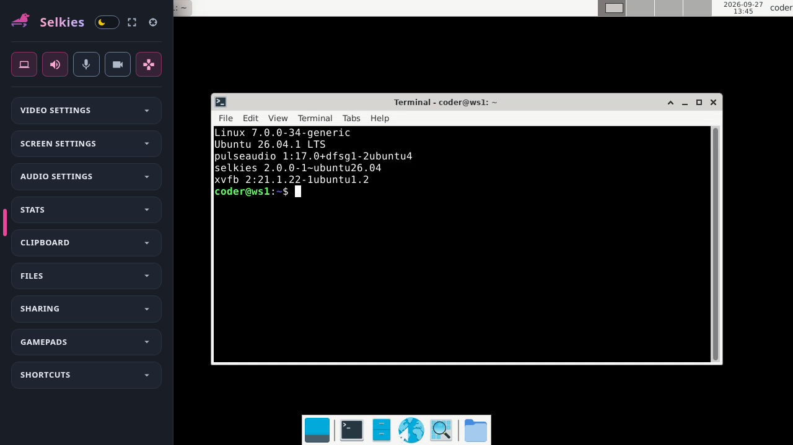

# Selkies

Stream the workspace's desktop to the browser with [Selkies](https://github.com/selkies-project/selkies): low latency at high frame rates, audio in both directions, gamepads, and the GPU encoding the stream where the workspace has one. Coder authenticates the app and proxies it over one WebSocket, on a subdomain or a path.

```tf
module "selkies" {
  count               = data.coder_workspace.me.start_count
  source              = "registry.coder.com/selkies-project/selkies/coder"
  version             = "1.0.0"
  agent_id            = coder_agent.main.id
  desktop_environment = "xfce"
}
```

> [!IMPORTANT]
> The workspace needs a desktop installed, as the [`codercom/example-desktop`](https://hub.docker.com/r/codercom/example-desktop) image has.



`desktop_environment` names a session installed in the workspace (`xfce`, `kde`, `lxqt`, `gnome`, `mate`) or gives a command to run; empty starts the workspace's default desktop. The module's variables are those of the [KasmVNC module](https://registry.coder.com/modules/coder/kasmvnc), so a template swaps one for the other or offers both.

## Selkies in the Image

Where the image carries Selkies and Xvfb, the module installs nothing and needs neither `sudo` nor network access, and `install_selkies = false` keeps it that way. Selkies publishes native packages, a Python wheel, and an AppImage; see its [native install guide](https://github.com/selkies-project/selkies/blob/main/docs/native.md).

```tf
module "selkies" {
  count               = data.coder_workspace.me.start_count
  source              = "registry.coder.com/selkies-project/selkies/coder"
  version             = "1.0.0"
  agent_id            = coder_agent.main.id
  desktop_environment = "xfce"
  install_selkies     = false
}
```

## Installing at Start

Otherwise, the module installs the release's native package, the distribution's Xvfb, and PulseAudio where the workspace has no sound server, as root or with passwordless `sudo`, on the distributions a release publishes packages for (for 2.0.0: Ubuntu 24.04 and 26.04, Debian 12 and 13, Fedora, RHEL 9 and its rebuilds, Alpine, and Arch Linux). `selkies_version` pins a release, and `release_url` points at a mirror laid out like GitHub's releases.

```tf
module "selkies" {
  count               = data.coder_workspace.me.start_count
  source              = "registry.coder.com/selkies-project/selkies/coder"
  version             = "1.0.0"
  agent_id            = coder_agent.main.id
  desktop_environment = "xfce"
  selkies_version     = "2.0.0"
  release_url         = "https://artifacts.example.com/selkies/releases"
}
```

## Wayland

`wayland = true` streams through Selkies' Wayland backend instead of an Xvfb. The desktop is then a Wayland compositor, or a desktop that starts one, nested in Selkies' own.

```tf
module "selkies" {
  count               = data.coder_workspace.me.start_count
  source              = "registry.coder.com/selkies-project/selkies/coder"
  version             = "1.0.0"
  agent_id            = coder_agent.main.id
  desktop_environment = "labwc"
  wayland             = true
}
```

## Network Access

The module contacts the network only when it installs:

- `<release_url>/latest`, to resolve the latest release without GitHub's rate-limited API, unless `selkies_version` is set.
- `<release_url>/download/<version>/selkies-<version>-<platform>`, the package.
- The distribution's package repositories, for Xvfb, PulseAudio, and the package's dependencies.

Once it runs, the browser reaches Selkies through Coder's proxy on the workspace's loopback addresses; no WebRTC, STUN, or TURN server is involved.

## Troubleshooting

The logs are in `~/.coder-modules/selkies-project/selkies/logs/`: `install.log`, `start.log`, and Selkies' own `selkies-session.log`. `coder port-forward <workspace> --tcp 8080:8080` reaches the same desktop at `http://localhost:8080`, which browsers treat as a secure context for the clipboard, gamepads, and the microphone.
