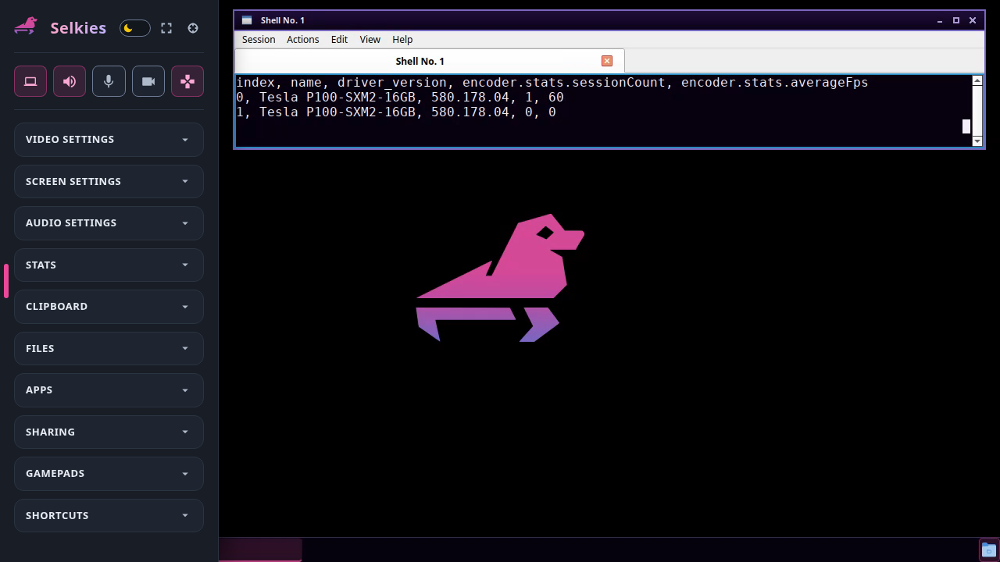

# Selkies Desktop on Docker

Provision Docker containers as [Coder workspaces](https://coder.com/docs/workspaces) that run [Selkies' desktop image](https://docs.selkies.io/components/desktop-image): an LXQt desktop with Firefox and Google Chrome, streamed to the browser by the [Selkies module](https://registry.coder.com/modules/selkies-project/selkies) with low latency, audio in both directions, and gamepads, and encoded on an NVIDIA GPU where the workspace has one.

## Prerequisites

Coder needs access to a Docker socket, as for the [Docker Containers](https://registry.coder.com/templates/coder/docker) template.

A workspace on an NVIDIA GPU needs the [NVIDIA Container Toolkit](https://docs.nvidia.com/datacenter/cloud-native/container-toolkit/latest/install-guide.html) v1.20.1 or higher on the Docker host, with its `nvidia` runtime registered with Docker (`sudo nvidia-ctk runtime configure --runtime=docker`). The desktop then renders and encodes on the GPU, on X11 and on Wayland alike. Without one, it renders and encodes in software, even on a host whose default runtime is NVIDIA's.

Intel and AMD GPUs take the DRM render node and its group instead: add `devices { host_path = "/dev/dri" }` and `group_add = ["<group ID of /dev/dri/renderD128 on the Docker host>"]` to the container, as Selkies' [Getting Started](https://docs.selkies.io/start) does with `docker run`.

## Architecture

This template provisions the following resources:

- Docker container from `ghcr.io/selkies-project/selkies/desktop:latest-ubuntu26.04` (ephemeral)
- Docker volume (persistent on `/home/ubuntu`)

The Coder agent runs in place of the image's own init, and the Selkies module starts the image's default desktop and Selkies behind Coder's proxy, so the image's own login, TLS, and TURN server are not used. When the workspace restarts, anything outside the home directory is reset to the image.
