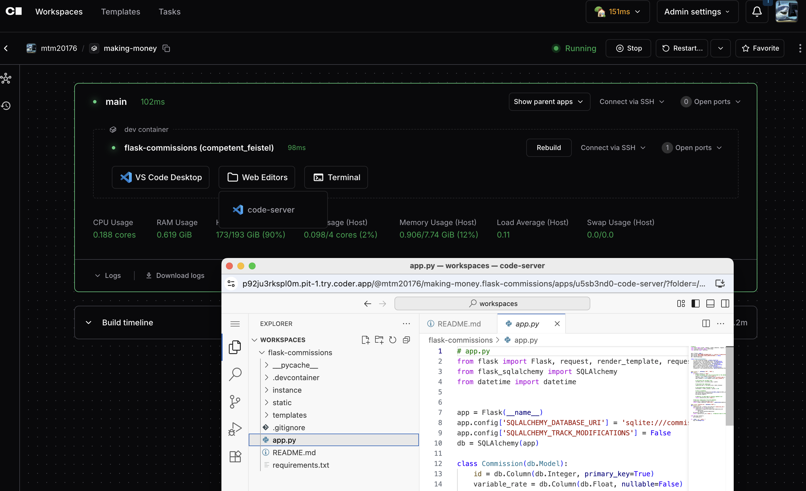

# Remote Development on Dev Containers

Provision Docker containers as [Coder workspaces](https://coder.com/docs/workspaces) running [Dev Containers](https://code.visualstudio.com/docs/devcontainers/containers) via Docker-in-Docker and the Dev Container CLI.



## Example devcontainer

The default example devcontainer is one of Sharkymark's sales commissions calculators. It is a Python Flask app and will auto-start so should be accessible on port 5000 when the workspace is running. See the repo on GitHub [here](https://github.com/sharkymark/flask-commissions).

The example repo `devcontainer.json` includes a feature to Coder' code-server web IDE which will be available in the Web Editors button in the workspace. It defaults to open in the `/workspaces` folder which is where the repo is cloned.

Happy selling! 🦈

## Prerequisites

### Infrastructure

The VM you run Coder on must have a running Docker socket and the `coder` user must be added to the Docker group:

```sh
# Add coder user to Docker group
sudo adduser coder docker

# Restart Coder server
sudo systemctl restart coder

# Test Docker
sudo -u coder docker ps
```

## Things to know

### docker prune

The template's `shutdown_script` runs `docker system prune -f` to clean up unused Docker resources when the workspace is stopped. This helps manage disk space on the host machine. Consider adjusting to make the workspace load faster if needed.

### devcontainers-cli Coder module

The template uses Coder's [devcontainers-cli module](https://registry.coder.com/modules/coder/devcontainers-cli) to install the `@devcontainers/cli` tool in the workspace. This is used to run Dev Containers inside the Docker-in-Docker container.

### Docker-in-Docker script

The template runs a custom script in the template called `docker-in-docker.sh` to do the following:

- Detects if Coder workspace is accessed via host.docker.internal and applies networking fixes if needed.
- Enables IP forwarding and sets up NAT rules to allow proper traffic flow between devcontainers and host.
- Forwards relevant ports (from the agent URL, or 80/443 by default) to the host gateway.
- Starts Docker service and determines workspace bridge IP for DNS resolution.
- Installs and configures dnsmasq so devcontainers can resolve host.docker.internal to the workspace’s IP.
- Configures Docker to use the custom DNS server, ensuring hostname resolution works inside all containers.

## Architecture

This example uses the `codercom/enterprise-node:ubuntu` Docker image as a base image for the workspace. See image on [DockerHub](https://hub.docker.com/r/codercom/enterprise-node) and Dockerfile on [GitHub](https://github.com/coder/images/tree/main/images/node) It includes necessary tools like Docker and Node.js, which are required for running Dev Containers via the `@devcontainers/cli` tool.

This template provisions the following resources:

- Docker image (built by Docker socket and kept locally)
- Docker container (ephemeral)
- Docker volume (persistent on `/home/coder`)
- Docker volume (persistent on `/var/lib/docker`)

This means, when the workspace restarts, any tools or files outside of the home directory or docker library are not persisted.

For devcontainers running inside the workspace, data persistence is dependent on each projects `devcontainer.json` configuration.
